## 【项目构建思路】<!-- {docsify-ignore} -->

<br>

**基于SpringBoot构建的WebSocket通信聊天室**

**1. 客户端聊天窗口的创建**

**2. 添加服务器与客户端的连接**

**3. 连接上以后将客户端的信息发送到服务器上**

**4. 利用多线程实现连接多个客户端**

**5. 多个客户端的信息发送到服务器上以后，服务器将信息发送到指定/每个客户端**

**6. 在服务器端要取到每个客户端的Session，才可以把信息发送到每个客户端上，利用集合类存储客户的多个线程的连接**

**7. 在客户端利用多线程接受服务器上的信息**

**8. 最后实现多人聊天室的效果**

**9. 后期修改程序中的不足和发现bug**

---------------------------------------

## 0. 项目展示

Room创建


Room加密


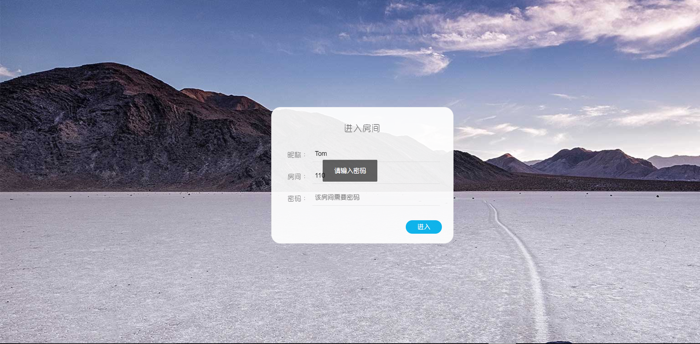

成功加入Room

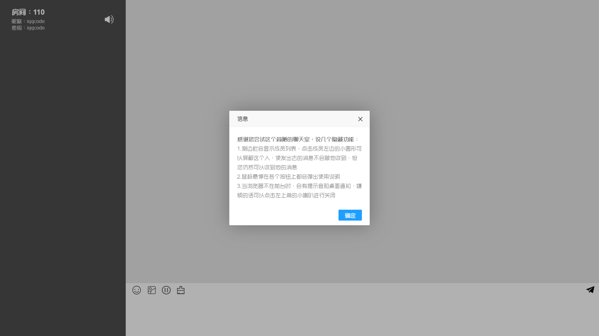

系统广播

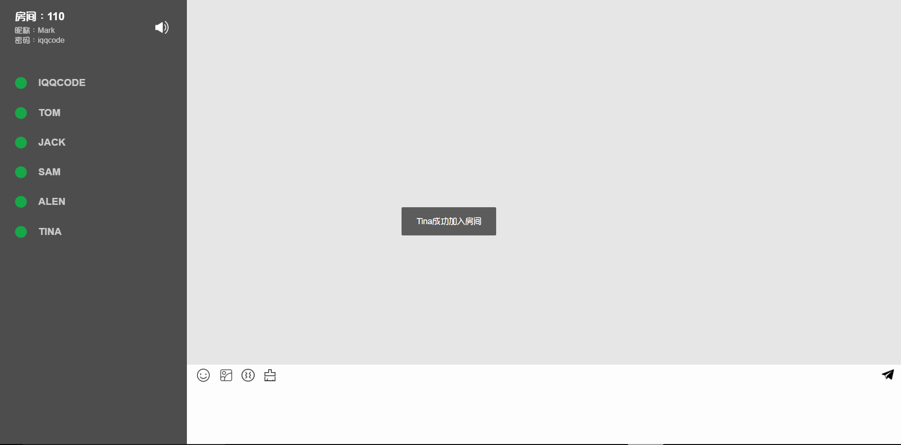

聊天区

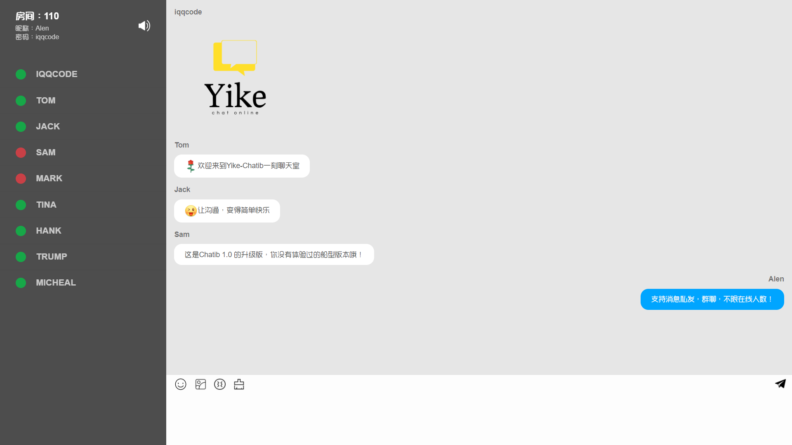

下线通知

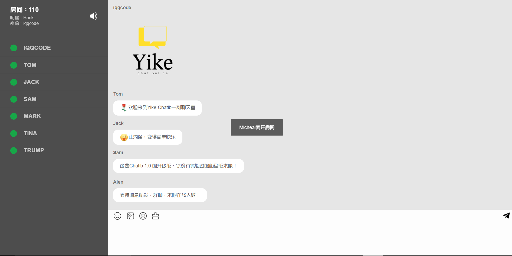

项目启动

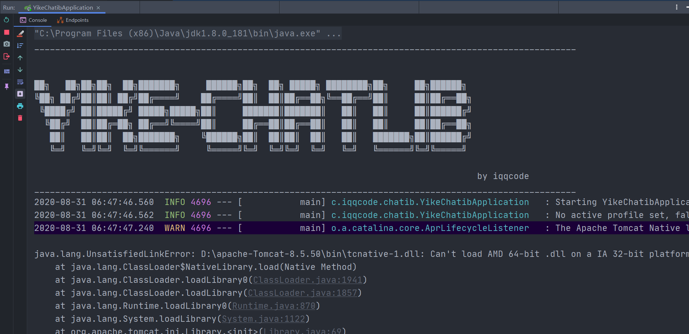

<br>

##  1. WebSocket

🔗我的博文章：[WebSocket协议](https://blog.csdn.net/weixin_43232955/article/details/107887829)

Websocket是**HML5**开始提供的一种在**单个TCP连接上进行全双工通讯**的协议。没有了 Request 和 Response 的概念，两者地位完全平等，连接一旦建立，就建立了真持久性连接，双方可以随时向对方发送数据。使得服务器和客户端交互数据更加简单。浏览器和客户端只需要完成一次握手，就可以创建持久性的连接，并进行双向的数据

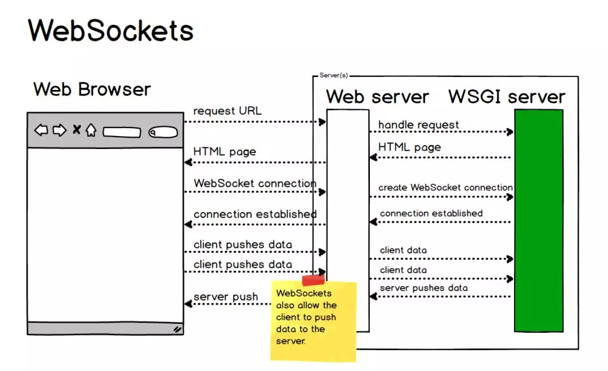

### 1.1 请求数据

客户端request请求头：

```http
GET ws://localhostchat HTTP/1.1
Host: localhost
Upgrade: websocket  //表示要升级到websocket协议
Connection: Upgrade
Sec-WebSocket-Extensions: permessage-deflate;
Sec-WebSocket-Key: 5fTJ1LTuh3RKjSJxydyifQ==		// 与响应头 Sec-WebSocket-Accept 相对应
Sec-WebSocket-Version: 13	//表示websocket协议的版本	
```

服务端response响应头：

```http
HTTP/1.1 101 Switching Protocols
Upgrade: websocket
Connection: Upgrade
Sec-WebSocket-Accept: ZUip34t+bCjhkvxxwhmdEOyx9hE=
Sec-WebSocket-Extensions: permessage-deflate;
```

【字段说明】

| 头名称                    | 说明                                                         |
| ------------------------- | ------------------------------------------------------------ |
| Connection: Upgrade       | 表示该HTTP请求是一个人协议升级请求                           |
| Upgrade: websocket        | 协议升级为WebSocket协议                                      |
| Sec-WebSocket-Version: 13 | 表示websocket协议的版本                                      |
| Sec-WebSocket-Key         | 与响应头 Sec-WebSocket-Accept 相对应，用来唯一标识客户端和服务器 |
| Sec-WebSocket-Extensions  | 协议拓展                                                     |

### 1.2 客户端通信

#### WebSocket对象

​	创建WebSocket对象：

```javascript
var ws = new WebSocket(url);  //请求的地址
```

> 参数url格式：`ws://ip地址:端口号/资源名称`

#### WebSocket事件

WebSocket对象的相关事件：

| 事件    | 事件处理程序   | 描述           |
| ------- | -------------- | -------------- |
| open    | websocket对象.onopen | 连接建立时触发 |
| message | websocket对象.onmessage | 客户端接收服务端数据时触发 |
| error   | websocket对象.onerror       | 通信发生错误是触发 |
| close   | websocket对象.onclose        | 连接关闭时触发 |

#### WebSocket方法

WebSocket对象的相关方法：

`send()`：使用连接发送数据

### 1.3 服务端通信

Java Websocket应用由一系列的 `WebSocketEndpoint`组成。 `Endpoint`是一个java对象，代表 WebSocket链接的一端。对于服务端，我们可以视为处理具体WebSocket消息的接口，就像Servlet之与HTTP请求一样。
我们可以通过两种方式定义 Endpoint：

- 第一种是编程式，即继承类 `javax.websocket`，Endpoint并实现其方法
- 第二种是注解式，即定义一个`POJO`，并添加 `ServerEndpoint`相关注解

`Endpoint`实例在 WebSocket握手时创建，并在客户端与服务端链接过程中有效，最后在链接关闭时结束。在Endpoint接口中明确定义了与其生命周期相关的方法，规范实现者确保生命周期的各个阶段调用实例的相关方法。生命周期方法如下：

| 方法      | 含义                                             | 注解       |
| --------- | ------------------------------------------------ | ---------- |
| onClose   | 当会话开启时调用                                 | @OoClose   |
| onOpen    | 当开启一个新的会话，客户端与服务器握手成功后调用 | @OnOpne    |
| onError   | 连接规程中产生异常                               | @OnError   |
| OnMessage | 客户端接收服务端数据时触发                       | @OnMessage |

**服务端如何接收客户端发送的数据呢？**

通过为 Session添加 MessageHandler消息处理器来接收消息，当采用注解方式定义 Endpoint时，我们还可以通过`@OnMessage`注解指定接收消息的方法。

**服务端如何推送数据绐客户端呢？**

发送消息则由 RemoteEndpoint完成，其实例由 session维护，根据使用情况，我们可以通过`Session.getBasicRemote`获取同步消息发送的实例，然后调用其 `sendXxx()`方法就可以发送消息，可以通过`Session.getAsyncRemote`获取异步消息发送实例

#### 心跳保活

在实际使用 WebSocket 中，长时间不通消息可能会出现一些连接不稳定的情况，这些未知情况导致的连接中断会影响客户端与服务端之前的通信，

为了防止这种的情况的出现，有一种心跳保活的方法：客户端就像心跳一样每隔固定的时间发送一次 ping，来告诉服务器，我还活着，而服务器也会返回 pong，来告诉客户端，服务器还活着。ping/pong 其实是一条与业务无关的假消息，也称为心跳包。

可以在连接成功之后，每隔一个固定时间发送心跳包，比如 60s:

```javascript
setInterval(() => {
    ws.send('这是一条心跳包消息');
}, 60000)
```

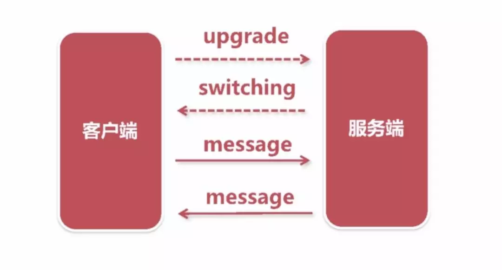

通过上面的介绍，大家应该对 WebSocket 有了一定认识，其实并不神秘，这里对文章内容简单总结一下。当创建 WebSocket 实例的时候，会发一个 HTTP 请求，请求报文中有个特殊的字段 Upgrade，然后这个连接会由 HTTP 协议转换为 WebSocket 协议，这样客户端和服务端建立了全双工通信，通过 WebSocket 的 send 方法和 onmessage 事件就可以通过这条通信连接交换信息。

---------------

【参考资料】

- [阮一峰的网络日志](http://www.ruanyifeng.com/blog/2017/05/websocket.html)
- [HTML5 WebSocket](https://www.runoob.com/html/html5-websocket.html)

--------------------


## 2. 聊天架构搭建


### 2.1 消息格式

**客户端 ——> 服务器**

```json
{"toName":"张三","message":"你好"}
```

**客户端 <—— 服务器**

- 系统消息格式：

```json
{"isSystem":true,"fromName":null,"message":["李四","王五"]}
```

- 私发消息格式

```json
{"isSystem":false,"fromName":"张三","message":"你好"}
```

客户端发送：

- JSON格式，给谁发、发送内容

服务器推送：

- 系统消息：消息推送，所有用户
- 私发推送：具体用户

### 2.2 SpringBoot 集成 websocket

**pom.xml**

```java
<dependency>
  <groupId>org.springframework.boot</groupId>
  <artifactId>spring-boot-starter-websocket</artifactId>
</dependency>
```

**WebSocketConfig**

```java
package cn.coder4j.study.example.websocket.config;

import org.springframework.context.annotation.Bean;
import org.springframework.context.annotation.Configuration;
import org.springframework.web.socket.config.annotation.EnableWebSocket;
import org.springframework.web.socket.server.standard.ServerEndpointExporter;

/**
 * @author buhao
 * @version WebSocketConfig.java, v 0.1 2019-10-18 15:45 buhao
 */
@Configuration
@EnableWebSocket
publicclass WebSocketConfig {

    @Bean
    public ServerEndpointExporter serverEndpoint() {
        returnnew ServerEndpointExporter();
    }
}
```

说明：

这个配置类很简单，通过这个配置SpringBoot才能去扫描后面的关于 websocket 的注解。

**MyWebSocket**

我们要将`MyWebSocket`对象交给Spring容器来管理，所以添加`@Component`，添加配置类`MyWebSocket`来注入

```java
@ServerEndpoint(value = "/websocket")
@Component
public class MyWebSocket {

    /**
     * 连接成功
     *
     * @param session
     */
    @OnOpen
    public void onOpen(Session session) {
        System.out.println("连接成功");
    }

    /**
     * 连接关闭
     *
     * @param session
     */
    @OnClose
    public void onClose(Session session) {
        System.out.println("连接关闭");
    }

    /**
     * 接收到消息
     *
     * @param text
     */
    @OnMessage
    public String onMsg(String text) throws IOException {
        return"servet 发送：" + text;
    }
}
```

注入ServerEndpointExporter bean对象，自动注册使用了@ServerEndpoint注解的bean

```java
@Configuration
public class WebSocketConfig {
    @Bean
    //注入ServerEndpointExporter bean对象，自动注册使用了@ServerEndpoint注解的bean
    public ServerEndpointExporter serverEndpointExporter() {
        return new ServerEndpointExporter();
    }

}
```


**说明**

这里有几个注解需要注意一下，首先是他们的包都在 **javax.websocket **下。并不是 spring 提供的，而 jdk 自带的，下面是他们的具体作用。

1. **@ServerEndpoint**
2. 通过这个 spring boot 就可以知道你暴露出去的 ws 应用的路径，有点类似我们经常用`@RequestMapping`。比如你的启动端口是 8080，而这个注解的值是 ws，那我们就可以通过 `ws://127.0.0.1:8080/ws` 来连接你的应用
3. **@OnOpen**
4. 当 websocket 建立连接成功后会触发这个注解修饰的方法，注意它有一个  Session 参数
5. **@OnClose**
6. 当 websocket 建立的连接断开后会触发这个注解修饰的方法，注意它有一个  Session 参数
7. **@OnMessage**
8. 当客户端发送消息到服务端时，会触发这个注解修改的方法，它有一个 String 入参表明客户端传入的值
9. **@OnError**
10. 当 websocket 建立连接时出现异常会触发这个注解修饰的方法，注意它有一个  Session 参数

另外一点就是服务端如何发送消息给客户端，服务端发送消息必须通过上面说的 Session 类，通常是在@OnOpen 方法中，当连接成功后把 session 存入 Map 的 value，key 是与 session 对应的用户标识，当要发送的时候通过 key 获得 session 再发送，这里可以通过  **session.getBasicRemote\*()\*.sendText\*(*)** 来对客户端发送消息。


------------------

【参考文章】

- [Spring WebSocket Support](https://docs.spring.io/spring/docs/current/spring-framework-reference/html/websocket.html)

- [WebSocket教程](http://www.ruanyifeng.com/blog/2017/05/websocket.html)
- [Node.js + WebSocket打造及时聊天程序嗨聊](http://www.cnblogs.com/Wayou/p/hichat_built_with_nodejs_socket.html)

------------------

## 3. 广播推送，房间信息统计

### 3.1 服务端MyWebSocket属性


```java
    //打印日志信息
    private static final Logger logger = LoggerFactory.getLogger(MyWebSocket.class);

    //静态变量，用来记录当前在线连接数。应该把它设计成线程安全的。
    private static int onlineCount = 0;

    //与某个客户端的连接会话，需要通过它来给指定的客户端发送数据
    private Session session;

    //用以记录用户和房间号的对应关系(sessionId,room)
    private static HashMap<String,String> RoomForUser = new HashMap<String,String>();

    //用以记录房间和其中用户群的对应关系(room,List<用户>)
    public static HashMap<String, CopyOnWriteArraySet<User>> UserForRoom = new HashMap<String,CopyOnWriteArraySet<User>>();

    //用以记录房间和其中用户群的对应关系(room,List<用户>)
    public static HashMap<String,String> PwdForRoom = new HashMap<String,String>();

    //用来存放必应壁纸
    public static List<String> BingImages = new ArrayList<>();

    private Gson gson = new Gson();

    private Random random = new Random();
```

【同步问题】

1. 为了防止多用户下，房间人数`onlineCount`统计出现异常，统计人数方法**addOnlineCount**要用`synchronized`确保同步

2. 当前用户对象获取后，要放入容器中存储，保证同步放到了`CopyOnWriteArraySet`线程安全的Set中

	> [线程安全的CopyOnWrite容器](https://blog.csdn.net/linsongbin1/article/details/54581787?utm_medium=referral)
	>
	> [JAVA中的COPYONWRITE容器](https://coolshell.cn/articles/11175.html)

#### 人数统计

```java
	public static synchronized int getOnlineCount() {
        return onlineCount;
    }

    public static synchronized void addOnlineCount() {
        MyWebSocket.onlineCount++;
    }

    //同房间用户下线, count--
    public static synchronized void subOnlineCount() {
        MyWebSocket.onlineCount--;
    }
```

#### 上线消息广播

WebSocket session发送文本消息有两个方法：

- `getAsyncRemote()`

- `getBasicRemote() `

getAsyncRemote是 **非阻塞式** 的，getBasicRemote是**阻塞式** 的。

由于getBasicRemote()的同步特性，并且它支持部分消息的发送即`sendText`的值表示是否一次发送消息中的部分消息，对于如下情况：

```java
session.getBasicRemote().sendText(message, false); 

session.getBasicRemote().sendBinary(data);

session.getBasicRemote().sendText(message, true); 
```

由于同步特性，第二行的消息必须等待第一行的发送完成才能进行，而第一行的剩余部分消息要等第二行发送完才能继续发送，所以在第二行会抛出`IllegalStateException`异常。

如果要使用getBasicRemote()同步发送消息，则避免尽量一次发送全部消息，使用部分消息来发送。

综上所述，我采用`getBasicRemote()`同步发送消息

```java
/**
 * 上线消息广播
 * @param message
 * @throws IOException
 */
public void sendMessage(String message) throws IOException {
    this.session.getBasicRemote().sendText(message);
}
```


### 3.2 客户端

服务端将广播消息推送给客户端，客户端接收到服务端推送的消息后回调`onmessage`方法

```javascript
//客户端接收到服务端推送的消息后回调方法
websocket.onmessage = function(event){
    var data = JSON.parse(event.data)
    var msg = data.msg;
    var nick = data.sendUser;
    var shakeStatus = data.shake;
    if (focus && mute%2==0) {
        playSound();
        notifyMe(data);
    }
    switch(data.type){
        case 'init':
            getOnlion(document.getElementById('room').value);
            layer.msg(msg);
            break;
        case 'msg':
            setMessageInnerHTML(nick,text2Emoji2(msg),shakeStatus);
            break;
        case 'img':
            setImgInnerHTML(nick,msg);
            break;
        case 'bing':
            document.getElementById('userId').value = data.id;
            $('body').css("background-image","url("+msg+")");
            break;
        default:
            break;
    }
}
```

<br>

<hr>

<br>

## 4. 聊天功能实现

### 4.1 会话实现

**Tomcat会话机制实现。**

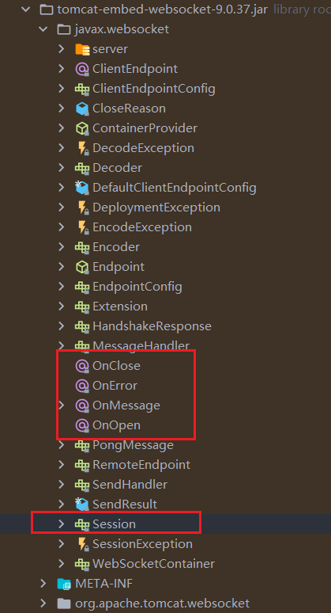

<br>

当每一个客户端和服务器建立连接之后，即`OnOpen`方法执行完之后，我们将客户端的会话信息即`session`存储到**线程安全的集合CopyOnWriteArraySet中**，同时将消息数据放入到**HashMap**中

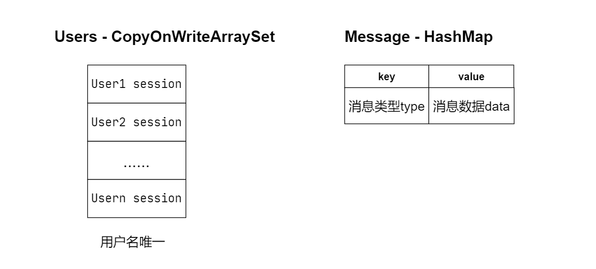

#### 私聊

【消息格式】

```json
{"isSystem":false,"fromName":"张三","message":"你好"}
```

根据前端传回的`session`，单独给该用户推送即可

```java
private User getUser(Session session) {
    String room = RoomForUser.get(session.getId());
    CopyOnWriteArraySet<User> users = UserForRoom.get(room);
    for (User user : users) {
        if (session.getId().equals(user.getId())) {
            return user;
        }
    }
    return null;
}
```

#### 群聊

【消息格式】

```json
{"isSystem":true,"fromName":null,"message":["李四","王五"]}
```

遍历**Users**集合，服务器为每位用户推送消息

```java
private void sendMessagesAll(CopyOnWriteArraySet<User> users, String message){
    //群发消息
    for (User item : users) {
        try {
            item.getWebSocket().sendMessage(message);
        } catch (IOException e) {
            e.printStackTrace();
        }
    }
}
```


<br>

<hr>

### 4.2 客户端消息发送

客户端发送消息时，先发送数据给服务端，服务端推送给指定用户

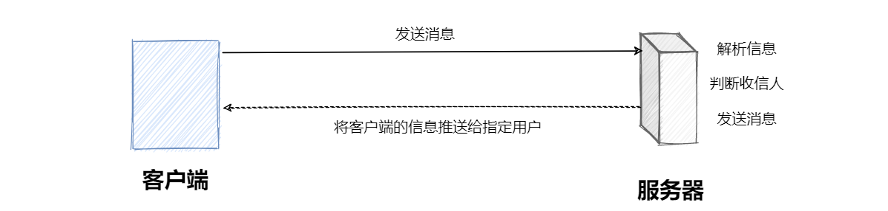

#### 客户端发送至服务端

将消息存储到**Map**中，`key`为发送的类型，`value`为发送内容

```javascript
//发送消息
function send() {
    var msg = document.getElementById('text').innerHTML;
    if (msg != null && msg != "") {
        msg = msg.replace(/"/g, "'");
        var map = new Map();
        map.set("type", "msg");
        map.set("msg", msg);
        
        var map2json = Map2Json(map);
        //发送数据给服务端，服务端推送给指定用户
        websocket.send(map2json); 
    } 
}
```

#### 客户端JS获取当前Room内所有User

发送异步请求来获取统计，并存入session

```javascript
//获得当前房间中的所有用户
function getOnlion(room) {
    $.ajax({
        type: "POST",
        url: "/ws/online",
        data: {room: room},
        dataType: "json",
        success: function (data) {
            if (data.onlineNum > 0) {
                var onlineUsera = data.onlineUsera;
                $("#cebian").html("");
                onlineUsera.forEach(function (user) {
                    var color = "#00ce46";
                    if (shieldMap.has("user-" + user.id)) {
                        color = "#FF3A43"
                    }
                    if (user.id != $("#userId").val()) {
                        $("#cebian").append(html);
                    }
                });
            }
        }
    });
}
```


--------

### 4.3 服务端转给客户端

#### Gosn解析为JavaBean

服务器将客户端发送来的`json`格式通过**Gosn**解析为**JavaBean**对象

```json
{"isSystem":true,"fromName":null,"message":["李四","王五"]}
```

【转换Demo】

```java
public static void main(String args[])  {      
        String response = "[{name:ming,height:100,width:50},{name:hong,height:200,width:100},{name:jing,height:300,width:150}]";
    
        Gson gson = new Gson();
        List<ImageBean> iamgeBeanList = gson.fromJson(response, new TypeToken<List<ImageBean>>() {}.getType());
        iamgeBeanList.forEach(bean->System.out.println(bean.title + " "+bean.height+" "+bean.width));
        String json = gson.toJson(iamgeBeanList);
        System.out.println(json);
    }
 
    public class ImageBean implements Serializable {
 
        public static final long serialVersionUID = 1L;
        @SerializedName("name")
        public String title;
 
        @SerializedName("height")
        public int height;
 
        @SerializedName("width")
        public int width;
    }
```

转换结果

```json
ming 100 50
hong 200 100
jing 300 150
[
    {"name":"ming","height":100,"width":50},
    {"name":"hong","height":200,"width":100},
    {"name":"jing","height":300,"width":150}
]
```

#### 服务端OnMessage实现

- 服务端收到客户端消息后调用`onMessage`方法，将json-message转为`message`对象
- 将解析出的数据存放到Map中(前后端数据结构保持一致)

主要的信息包含：

1. 消息数据
	- 消息类型
	- 消息内容
	- 发送给谁
2. Room数据
	- room-id
	- username
	- room-password

```java
@OnMessage
public void onMessage(String message, Session session) {
    //将json-message转为message对象
    Map<String, String> map = new Gson().fromJson(message, new TypeToken<HashMap<S
    }.getType());
    //容器来保存转换后的数据
    Map<String, String> result = new HashMap<>();
    User user = null;
    String shiels = map.containsKey("shiels") ? map.get("shiels").toString() : nul
    switch (map.get("type")) {
        //消息数据
        case "msg":
            //获取要发送的用户
            user = getUser(session);
            //将数据放入容器
            result.put("type", "msg"); //消息类型
            result.put("msg", map.get("msg")); //消息内容
            result.put("sendUser", user.getNickname()); //发送给谁
            result.put("shake", map.get("shake")); //消息动画
            break;
        //Room数据
        case "init":
            //获取当前Room信息: room-id,username,room-password
            String room = map.get("room");
            String nick = map.get("nick");
            String pwd = map.get("pwd");
            if (room != null && nick != null) {
                user = new User(session.getId(), nick, this);
                //如果房间不存在，新建房间
                if (UserForRoom.get(room) == null) {
                    CopyOnWriteArraySet<User> roomUsers = new CopyOnWriteArraySet<
                    roomUsers.add(user);
                    UserForRoom.put(room, roomUsers);
                    if (StrUtil.isNotEmpty(pwd)) {
                        PwdForRoom.put(room, pwd);
                    }
                    RoomForUser.put(session.getId(), room);
                } else {
                    UserForRoom.get(room).add(user);
                    RoomForUser.put(session.getId(), room);
                }
                result.put("type", "init");
                result.put("msg", nick + "成功加入房间");
                result.put("sendUser", "系统消息"	);
            }
            break;
    }
} 
```

- `getUser()`：通过当前用户的session获取待发送的目标用户
- `getUsers()`：通过当前用户的session获取当前room内的所有用户


----------------------

### 4.4 消息展示

将服务端推送的消息进行展示，包括以下几种类别：

- [x] 文本消息展示
- [x] 表情包展示
- [ ] 发送图片展示
- [ ] 消息动画效果


#### 消息展示界面Demo

**实现一：其他人消息展示在左侧，自己的消息展示在右侧，颜色区分**

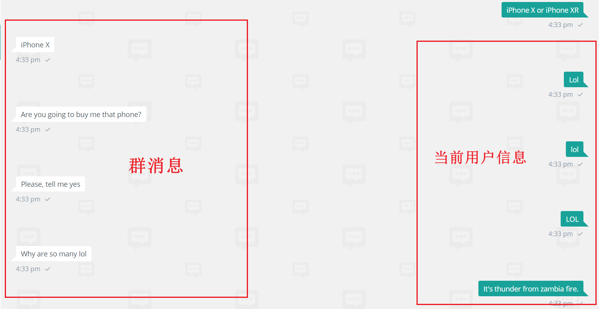

【左侧他人信息展示】

> 此处数据已经动态获取

```java
function setMessageInnerHTML(nick, msg, shake) {
    var a = '<div class="botui-message-left"><div ondblclick="stopShake(this)" class="botui-message-content shake-constant shake-constant--hover';
    //jQuery 将消息追加渲染
    $("#message").append("<div class='sendUser'><b>" + nick + "</b></div>" + a + msg + b);
    scrollToEnd();
    $(".botui-message-content").animate({'margin-left': '0px'}, 200);
}
```

【右侧自己信息展示】

```java
<!--div属性设置为right-->
    
$("#message").append("<div class='sendUser' style='text-align: right;'><b>" + nick + "</b></div>" + c + msg + b);
```

- [ ] 发送图片展示
- [ ] 消息动画效果

> 图片和消息动画有待完善。

**实现二：消息私发，对某些用户不可见**

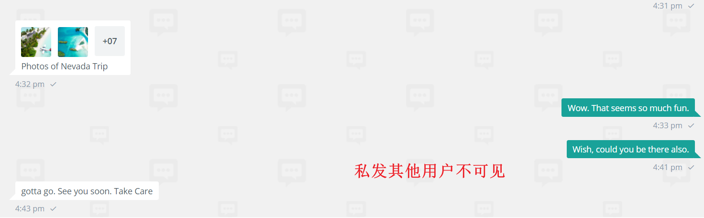

通过点击事件获取到该用户`id`，屏蔽该用户，不让其接收到我发送的消息

```javascript
function shield(obj) {
    var userId = obj.id.substring(5)
    if (userId != $("#userId").val()) {
        if (shieldMap.has(obj.id)) {
            shieldMap.delete(obj.id);
        } else {
            shieldMap.set(obj.id, userId);
        }
        getOnlion(document.getElementById('room').value);
    }
}
```


### 4.5 下线通知

当Room内有用户退出时，会广播该用户下线，同时好友列表就不再显示此用户。

以上的逻辑操作，在`onClose()`中完成响应逻辑

【步骤分析】

- 从session中获取到该用户
- users用户列表中删除该用户
- 系统消息广播

```java
@OnClose
public void onClose() {
    subOnlineCount();
    //从session中获取到该用户
    CopyOnWriteArraySet<User> users = getUsers(session);
    if (users!=null) {
        String nick = "某人";
        for (User user : users) {
            if (user.getId().equals(session.getId())){
                nick = user.getNickname();
            }
        }
        //系统消息广播
        Map<String,String> result = new HashMap<>();
        result.put("type","init");
        result.put("msg",nick+"离开房间");
        result.put("sendUser","系统消息");
        sendMessagesOther(users,gson.toJson(result));
        //users用户列表中删除该用户
        User closeUser = getUser(session);
        users.remove(closeUser);
        RoomForUser.remove(session.getId());
    }
}
```

> PS：**此处踩坑**。考虑步骤到无用户还需关闭当前Room

此时，还可能出现当前Room无用户，则自动关闭，添加逻辑判断。

```java
//逻辑判断,如果当前Room无用户，则自动关闭
if (users.size() == 0){
	String room = RoomForUser.get(session.getId());
	UserForRoom.remove(room);
	PwdForRoom.remove(room);
}
```


-------------------------

【参考文章】

- [StrUtil 源码解析](https://mp.weixin.qq.com/s?src=11&timestamp=1597752291&ver=2530&signature=IG1osbMOSQFRjKodrSaFPJtWgzKFfX36GanRyK*ZVnlpomqtn3mlPkJ8RITqCVzmGu3RSHLGOeznYkW4-9oL4n2HLCLgwwKDLrSwA6TLZG5fa0E-B2WaGFPWX2xPCeyr&new=1)
- [Hutool之字符串工具——StrUtil](https://www.it610.com/article/2099701.htm)
- [JavcScript Map and Set](https://zh.javascript.info/map-set)
- [js：如何截取含有表情的字符串](https://www.xiabingbao.com/post/truncated/js-string-truncated.html)
- [GSON](https://www.jianshu.com/p/75a50aa0cad1)

------------------------


## 5. 用户体验完善

### 5.1 添加Error处理

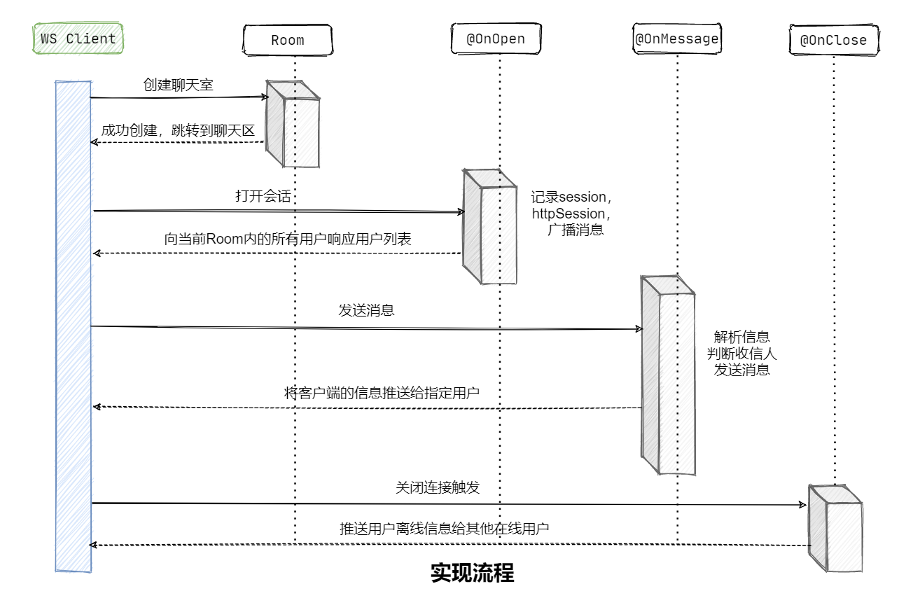

正常来讲，用户退出当前Room，该Room就会系统广播。但是，如果是遇到一些异常情况，如：

- 网络掉线
- 网络拥塞
- 异常IO流
- 电脑故障

等网络突发情况，客户端以下线，或者当前Room处于无人状态，可能会让服务器一直处于等待。所以需要在`OnError()`中处理

```java
@OnError
public void onError(Session session, Throwable error) {
    logger.debug("---------------------与{}的连接发生错误---------------------",
    subOnlineCount();
    CopyOnWriteArraySet<User> users = getUsers(session);
    if (users != null) {
        String nick = "某人";
        for (User user : users) {
            if (user.getId().equals(session.getId())) {
                nick = user.getNickname();
            }
        }
        Map<String, String> result = new HashMap<>();
        result.put("type", "init");
        result.put("msg", nick + "离开房间");
        result.put("sendUser", "系统消息");
        sendMessagesOther(users, gson.toJson(result));
        User closeUser = getUser(session);
        users.remove(closeUser);
        if (users.size() == 0) {
            String room = RoomForUser.get(session.getId());
            UserForRoom.remove(room);
            PwdForRoom.remove(room);
        }
        RoomForUser.remove(session.getId());
    }
    error.printStackTrace();
}
```


### 5.2 首页优化

加入Bing壁纸作为背景图片，每次打开网页时更新

**API**：👉[bing](https://github.com/xCss/bing)


页面引入参考：[获取必应每日壁纸(api)](https://blog.csdn.net/m0_37682004/article/details/82314055)

---------------------------

## 6. 踩坑记录

参见博客

## 7. 展望优化

Spring并不是专门的网络框架，没有对网络做深入的优化。如果是高并发分布式场景下，使用**Netty**来构建。

Netty适用于：

- 原生的客户端应用
- 最求更高的性能