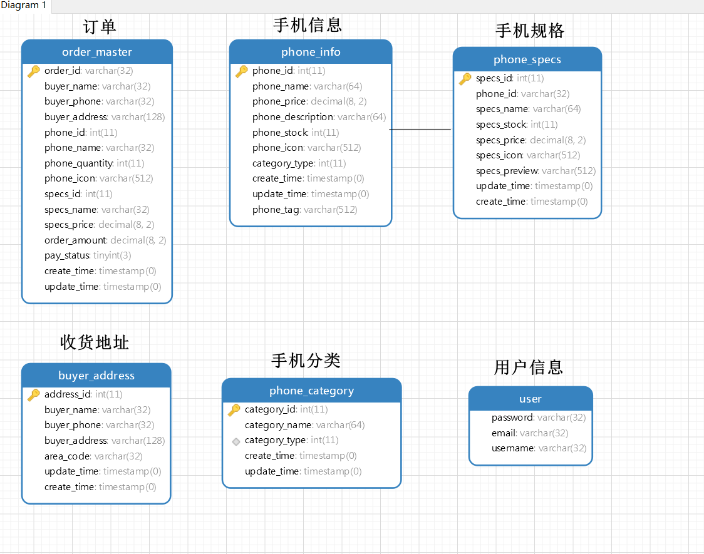

## 【项目预览】<!-- {docsify-ignore} -->


<br>

## 项目目录

```java
 ├── src
 │   ├── main
 │   │   ├── java
 │   │   │   └── com
 │   │   │       └── iqqcode
 │   │   │           └── store
 │   │   │               ├── config
 │   │   │               │   └── CorsConfig.java
 │   │   │               ├── controller
 │   │   │               │   ├── AddressHandler.java
 │   │   │               │   ├── OrderHandler.java
 │   │   │               │   └── PhoneHandler.java
 │   │   │               ├── dto
 │   │   │               │   └── OrderDTO.java
 │   │   │               ├── entity
 │   │   │               │   ├── BuyerAddress.java
 │   │   │               │   ├── OrderMaster.java
 │   │   │               │   ├── PhoneCategory.java
 │   │   │               │   ├── PhoneInfo.java
 │   │   │               │   └── PhoneSpecs.java
 │   │   │               ├── enums
 │   │   │               │   ├── PayStatusEnum.java
 │   │   │               │   └── ResultEnum.java
 │   │   │               ├── exception
 │   │   │               │   └── PhoneException.java
 │   │   │               ├── form
 │   │   │               │   ├── AddressForm.java
 │   │   │               │   └── OrderForm.java
 │   │   │               ├── PhoneStoreApplication.java
 │   │   │               ├── repository
 │   │   │               │   ├── BuyerAddressRepsitory.java
 │   │   │               │   ├── OrderMasterRepository.java
 │   │   │               │   ├── PhoneCategoryRepository.java
 │   │   │               │   ├── PhoneInfoRepository.java
 │   │   │               │   └── PhoneSpecsRepository.java
 │   │   │               ├── service
 │   │   │               │   ├── AddressService.java
 │   │   │               │   ├── impl
 │   │   │               │   │   ├── AddressServiceImpl.java
 │   │   │               │   │   ├── OrderServiceImpl.java
 │   │   │               │   │   └── PhoneServiceImpl.java
 │   │   │               │   ├── OrderService.java
 │   │   │               │   └── PhoneService.java
 │   │   │               ├── util
 │   │   │               │   ├── KeyUtil.java
 │   │   │               │   ├── PhoneUtil.java
 │   │   │               │   └── ResultVOUtil.java
 │   │   │               └── vo
 │   │   │                   ├── AddressVO.java
 │   │   │                   ├── DataVO.java
 │   │   │                   ├── OrderDetailVO.java
 │   │   │                   ├── PhoneCategoryVO.java
 │   │   │                   ├── PhoneInfoVO.java
 │   │   │                   ├── PhoneSpecsCasVO.java
 │   │   │                   ├── PhoneSpecsVO.java
 │   │   │                   ├── ResultVO.java
 │   │   │                   ├── SkuVO.java
 │   │   │                   ├── SpecsPackageVO.java
 │   │   │                   └── TreeVO.java
 │   │   └── resources
 │   │       ├── application.yml
 │   │       ├── static
 │   │       └── templates
```


## 前端项目搭建

### 前端项目搭建

**【前端技术栈】**：**vue + Vant UI + less**

**1. Vue CLI创建项目**


**2. Vant UI 安装**

```shell
cnpm i vant -S
```

**3. less安装命令**

```shell
cnpm install less less-loader --save
```

**4. 项目启动测试**

```shell
npm run serve
```


### Vant构建首页

#### 商品标签

每款手机都有自己得属性，品牌，特点等。

**Card卡片标签显示这些属性，在循环中遍历自身的属性内容即可展示**

Card商品卡片

```js
<van-card
  num="2"
  price="2.00"
  desc="描述信息"
  title="商品标题"
  thumb="https://img.yzcdn.cn/vant/ipad.jpeg"
/>
```


tag商品属性

```js
<template #tags>
	<van-tag v-for="tag in item.tag" color="#f2826a" style="margin-left: 5px;">{{tag.name}}		</van-tag>
</template>
```

<br>

#### 顶部Tag切换

归结于目前手机同质化太严重，很多手机都外观差别不是很明显。标配全面屏 + 多摄像，所以从手机的大体的颜色来分类，对比不同厂商手机的价格。

```js
<van-tabs v-model="active">
  <van-tab title="标签 1">内容 1</van-tab>
  <van-tab title="标签 2">内容 2</van-tab>
  <van-tab title="标签 3">内容 3</van-tab>
  <van-tab title="标签 4">内容 4</van-tab>
</van-tabs>
export default {
  data() {
    return {
      active: 2,
    };
  },
};
```


分类信息存放，遍历`categories`数组


遍历获取动态数据

```js
<van-tab v-for="index in categories.length" :title="categories[index-1].name" class="tab">
  <van-card v-for="(item,index) in phones"
            :price="item.price"
            :desc="item.desc"
            :title="item.title"
            :thumb="item.thumb"
  >
    <template #tags>
      <van-tag v-for="tag in item.tag" color="#f2826a" style="margin-left: 5px;">{{tag.name}}</van-tag>
    </template>
    <template #footer>
      <van-button round type="info" size="mini" @click="buy(index)">购买</van-button>
    </template>
  </van-card>
</van-tab>
```

**绑定点击事件**

在当前Title上绑定点击事件

```js
<van-tabs @click="onClick">
```

<br>

#### Button购买按钮

选择按钮

**按钮形状**

通过 `square` 设置方形按钮，通过 `round` 设置圆形按钮。

```html
<van-button square type="primary">方形按钮</van-button>
<van-button round type="info">圆形按钮</van-button>
```


<br>

#### 主页面搭建成型

- 先遍历Title，外城循环决定内层数据
- 再遍历当前Title下的Card
- 最后遍历某一Card的属性


<br>

<hr>


<br>

### sku商品规格

点击蓝色`Button`后跳转到商品规格页

【官方文档示例】

基础用法

```html
<van-sku
  v-model="show"
  stepper-title="我要买"
  :sku="sku"
  :goods="goods"
  :goods-id="goodsId"
  show-add-cart-btn
  reset-stepper-on-hide
  :initial-sku="initialSku"
  @buy-clicked="onBuyClicked"
>

  <!-- 自定义 sku actions -->
  <template #sku-actions="props">
    <div class="van-sku-actions">
      <van-button square size="large" type="warning" @click="onPointClicked">
        积分兑换
      </van-button>
      <!-- 直接触发 sku 内部事件，通过内部事件执行 onBuyClicked 回调 -->
      <van-button
        square
        size="large"
        type="danger"
        @click="props.skuEventBus.$emit('sku:buy')"
      >
        买买买
      </van-button>
    </div>
  </template>
</van-sku>
```


> https://vant-contrib.gitee.io/vant/#/zh-CN/sku

根据官方所给的案例，逐步删减（商品只是手机，相较而言无那么多属性）


<br>

### sku到地址页面的跳转传值

在上一个商品属性页面跳转到地址页面时，需要传递哪些数据？

- 选择的商品规格
- 购买数量

点击事件，`item`值传递

```js
onBuyClicked(item) {
  console.log(item)
  this.$store.state.specsId = item.selectedSkuComb.s1
  this.$store.state.quantity = item.selectedNum
  this.$router.push('/addressList')
}
```

**router**下配置路由，跳转到指定页面


<br>

----------------

### 地址列表

API


```js
export default {
  data() {
    return {
      chosenAddressId: '1',
      list: [
        {
          id: '1',
          name: '张三',
          tel: '13000000000',
          address: '浙江省杭州市西湖区文三路 138 号东方通信大厦 7 楼 501 室',
          isDefault: true,
        },
        {
          id: '2',
          name: '李四',
          tel: '1310000000',
          address: '浙江省杭州市拱墅区莫干山路 50 号',
        },
      ],
      disabledList: [
        {
          id: '3',
          name: '王五',
          tel: '1320000000',
          address: '浙江省杭州市滨江区江南大道 15 号',
        },
      ],
    };
  },
  methods: {
    onAdd() {
      Toast('新增地址');
    },
    onEdit(item, index) {
      Toast('编辑地址:' + index);
    },
  },
};
```

**地址选择**：遍历地址`list`集合即可

**新增地址**：导入地址省市区API

**修改地址**：修改时会自动传递（对象）默认值，修改时类比新增地址

将传来的地址对象转为`json`

```js
name: "AddressEdit",
created(){
    let data = JSON.parse(this.$route.query.item)
    this.addressInfo = data
    let index = data.address.indexOf('区')
    if(index < 0) index = data.address.indexOf('县')
    this.addressInfo.addressDetail = data.address.substring(index+1)
},
```

<br>

<hr>


<br>

### 订单详情

**简化了下单步骤，选择地址1s后默认下单成功，显示订单详情**

下单逻辑

```js
axios.post('http://localhost:8181/order/create',orderForm).then(function (resp) {
    if(resp.data.code == 0){
        let instance = Toast('下单成功');
        setTimeout(() => {
            instance.close();
            _this.$router.push('/detail?orderId='+resp.data.data.orderId)
        }, 1000)
    }
})
```

**订单detail页面，就是商品规格和地址栏信息的展示**。将二者的`data`的属性配合**Cell单元格组件**展示在页面

**基础用法**

`Cell` 可以单独使用，也可以与 `CellGroup` 搭配使用，`CellGroup` 可以为 `Cell` 提供上下外边框。

```html
<van-cell-group>
  <van-cell title="单元格" value="内容" />
  <van-cell title="单元格" value="内容" label="描述信息" />
</van-cell-group>
```


地址信息展示

```js
<van-cell-group class="goods-cell-group">
  <van-cell>
    <van-col span="16">
      <van-icon name="location-o" style="margin-right: 30px;"/>
      收货人：{{ data.buyerName }}
    </van-col>
    <van-col>{{ data.tel }}</van-col>
    <van-col span="21" style="padding-left: 43px;font-size: 13px">收货地址：{{ data.address }}</van-col>
  </van-cell>
</van-cell-group>
```

Card商品属性展示

```js
<van-card
    :num="data.num"
    :price="data.price"
    :desc="data.specs"
    :title="data.phoneName"
    :thumb="data.icon"
/>
```

<br>

### 订单支付

订单支付为了方便测试和修改，没有接入支付API。默认复合购买条件下，付款成功！

- 订单价格单位为分，单价 *  数量为总金额


订单详情展示，数据回显。

--------

【文档参考】

- [Vant](https://vant-contrib.gitee.io/vant/#/zh-CN/cell)
- [Vant 快速上手](https://www.w3cschool.cn/vantlesson/vantlesson-rig235ur.html)
- [Vue.js 开发基础教程](https://www.html.cn/study/4.html)
- [Vue.js 教程](https://www.runoob.com/vue2/vue-tutorial.html)

-------------------


## API接口规范

####  1. 首页数据

**url**

```
GET  /phone/index
```

参数

```
无
```

返回

```json
{
  code: 0,
  msg: "成功"，
  data: {
    categories: [
      {
        name: "极光蓝"，
        type: 1
      }
    ],
    phones: [
      id: 1,
      title: "Honno 8A",
      price: "2800.00",
      desc: "极光蓝",
      tag: [
        {
          name: "720P珍珠屏"
        },
        {
          name: "Micro USB接口"
        }
      ],
      thumb: "../static/1a2b8e30-6e98-405f-9a18-9cd31ff96c35.jpg"
    ]
  }
}
```


#### 2. 根据类型查询手机

```
GET /phone/findByCategoryType
```

参数

```
categoryType: 1
```

返回

```json
{
  code: 0,
  msg: "成功"，
  data: [
    {
      id: 1,
      title: "Honno 8A",
      price: "2800.00",
      desc: "极光蓝",
      tag: [
        {
          name: "720P珍珠屏"
        },
        {
          name: "Micro USB接口"
        }
      ],
      thumb: "../static/1a2b8e30-6e98-405f-9a18-9cd31ff96c35.jpg"
    }
  ]
}
```


#### 3 . 查询手机规格

```
GET /phone/findSpecsPhoneId
```

参数

```
phoneId: 1
```

返回

```json
{
  code: 0,
  msg: "成功"，
  data: {
    goods: {
      picture: "../static/1a2b8e30-6e98-405f-9a18-9cd31ff96c35.jpg"
    },
    sku: {
      tree: [
        {
          k: "规格",
          v: [
            {
              id: 1,
              name: "32GB",
              imgUrl: "../static/1a2b8e30-6e98-405f-9a18-9cd31ff96c35.jpg",
              previewImgUrl: "../static/1a2b8e30-6e98-405f-9a18-9cd31ff96c35.jpg"
            },
            {
            id: 2,
            name: "64GB",
            imgUrl: "../static/1a2b8e30-6e98-405f-9a18-9cd31ff96c35.jpg",
            previewImgUrl: "../static/1a2b8e30-6e98-405f-9a18-9cd31ff96c35.jpg"
            }
          ],
          k_s: "s1"
        }
      ],
      list: [
        {
          s1: 1,
          price: 280000,
          stock_num: 1
        },
        {
          s1: 2,
          price: 320000,
          stock_num: 1
        }
      ],
      price: "2800.00",
      stock_num: 2,
      none_sku: false,
      hide_stock: false
    }
  }
}
```

#### 4. 查询地址

```
GET /address/list
```

参数

```
无
```

返回

```json
{
  code: 0,
  msg: "成功"，
  data: [
    {
      areaCode: "440303",
      id: 21,
      name: "iqqcode",
      tel: "13678789632",
      address: "陕西省西安市临潼区123号"
    }
  ]
}
```


#### 5. 新增地址

```
POST /address/create
```

参数

```json
{
  name: "iqqcode",
  tel: "13678789632",
  country: "",
  province: "陕西省",
  city: "西安市",
  country: "临潼区",
  areaCode: "710048",
  postalCode: "",
  addressDetail: "123号路",
  isDefault: false
}
```

返回

```json
{
  code: 0,
  msg: "成功",
  data: null
}
```


#### 6. 修改地址

```
PUT /address/update
```

参数

```json
{
  "id": 38,
  "name": "王五",
  "tel": "15849488888",
  "addressDetail": "江汉路189号",
  "areaCode": "01100",
  "province": "北京市",
  "city": "北京市",
  "country": "朝阳区"
}
```

返回

```json
{
  code: 0,
  msg: "成功",
  data: null
}
```


#### 7. 新增订单

```
POST /order/create
```

参数

```json
{
  name: "iqqcode"
  tel: "13678789632"
  address: "陕西省西安市临潼区123号"
  specsId: 1
  quantity: 1
}
```

返回

```json
{
  code: 0,
  msg: "成功",
  data: {
    orderId: "1586242977480760998"
  }
}
```

> `OrderDTO`

#### 8. 订单详情

```
GET /order/detail
```

参数

```
orderId: "1586242977480760998"
```

返回

```json
{
  code: 0,
  msg: "成功",
  data:{
    orderId: "1586242977480760998",
    buyerName: "iqqcode",
    phoneName: "Honor 8A",
    payStatus: 0,
    freight: 10,
    tel: "13636363636",
    address: "陕西省西安市临潼区123号",
    num: 1,
    specs: "32GB",
    price: "2800.00",
    icon: "../static/e84a2e03-7f19-41d2-98a5-a5c16b7e252d.jpg",
    amount: 2800
  }
}
```

> `OrderDetailVO`

#### 9. 支付订单

```
PUT /order/pay
```

参数

```
orderId: "1586242977480760998"
```

返回

```json
{
  code: 0,
  msg: "成功",
  data: {
    orderId: "1586242977480760998"
  }
}
```


<br>


## 后端项目构建

### ORM框架选型

**主流ORM框架对比：**

| 对比项           | SpringData Jpa                                  | MyBatis                                 |
| ---------------- | ----------------------------------------------- | --------------------------------------- |
| **单表操作**     | 只需要继承，代码量少。支持方法名用关键字生成SQL | 编写SQL语句                             |
| **多表关联查询** | 动态SQL使用不方便，SQL和代码耦合在一起          | 直观方便的动态SQL                       |
| **自定义SQL**    | SQL写在注解内，动态SQL略微繁琐                  | SQL写在XML中，独立管理，动态SQL容易书写 |
| **应用**         | 中小型个人项目                                  | 大型项目                                |


> [Spring Data Jpa](https://spring.io/projects/spring-data-jpa)

**JPQL：**面向对象的查询语言，非面向数据库的查询语句来查询数据，**避免SQL语句紧密耦合**

### 选择Jap的优势

【Spring Data Jpa】

**全自动化的ORM框架**。**底层实现为Hibernate，可以根据实体类的字段信息，自动生成表，便捷的完成数据库表到Java实体类的映射**。**不用写接口和实现类，不用写SQL语句。类和表直接关联，不用考虑结果集的映射**

【MyBatis】

MyBatis为半自动化ORM框架，根据SQL语句生成查询的结果集，结果集和实体类的对应。

但是，Spring Data Jpa对动态SQL的支持没有MyBatis好用，使用比较复杂

#### 动态SQL

Mybatis应用中，SQL映射通常位于XML文件内，在执行前需要将XML中的映射转换为最终要执行的SQL。在转换中是否可以根据输入动态的处理SQL？这就是动态SQL

查询条件很复杂或者查询条件不确定，单一的SQL语句无法完成查询。例如查询：

【根据传入参数条件查询】user查询的条件：有可能有用户名，有可能有性别，也有可能有地址，还有可能是都有

MyBatis的动态SQL语句只是针对查询而言：

类型主要有三种：

- **条件判断**
- **内容处理**
- **循环处理**


### Jpa常用注解


## 数据库构建



**order_master订单**


**phone_Info手机信息**


**phone_specs手机规格**


**buyer_address收货地址**


**phone_catagory手机分类**


**user用户**


<br>

## repsitory持久层编写测试

### 实体类构建

- `@Entity `该类是实体类，Spring会将该类与该数据表自动关联
- 实体类与表名称一直，不需要添加 `@Table`
- 成员变量名和表字段不一致，加`@Column`
- `@DynamicInsert`  
- `@DynamicUpdate `  
- `GeneratedValue` 主键自增长

**成员变量必须符合驼峰命名法**

```java
@Data
@Entity
@Table(name = "buyer_address")
@DynamicInsert
@DynamicUpdate
public class BuyerAddress {
    @Id
    @GeneratedValue(strategy = GenerationType.IDENTITY)
    private Integer addressId;
    private String buyerName;
    private String buyerPhone;
    private String buyerAddress;
    private String areaCode;
    private Date createTime;
    private Date updateTime;
}
```

### 添加持久化接口

编写**BuyerAddress**类的`repository`接口，继承Jpa提供的接口`JpaRepository`，不需要写具体的实现，即可完成持久化操作

```java
import org.springframework.data.jpa.repository.JpaRepository;

public interface BuyerAddressRepsitory extends JpaRepository<BuyerAddress,Integer> {
}
```

泛型

```java
JpaRepository<实体类名,主键类型>
```

#### JpaRepository接口

- 增删改查接口，常用


### 单元测试

**1. 注入实体类名** 

```java
@Autowired
private BuyerAddressRepsitory repsitory;
```

**2. 测试**

- 查询所有购买者物流地址

```java
@Test
void findAll(){
    List<BuyerAddress> list = repsitory.findAll();
    for (BuyerAddress buyerAddress : list) {
        System.out.println(buyerAddress);
    }
}
```

自动帮我们生成SQL语句并且返回查询结果：


### Jpa的通用性

Jap有通用性，只会生成类的通用方法，与具体业务相关的方法需要自己声明

比如所根据规格来查询手机，这是特定的业务方法，需要自己声明

`repository`下接口下声明方法

```java
public interface PhoneCategoryRepository extends JpaRepository<PhoneCategory,Integer> {
    //根据规格查询手机
    PhoneCategory findByCategoryType(Integer categoryType);
}
```

测试

```java
@SpringBootTest
public class PhoneCategoryRepositoryTest {
    @Autowired
    private PhoneCategoryRepository repository;

    @Test
    public void findAll() {
        List<PhoneCategory> list = repository.findAll();
        for (PhoneCategory category : list) {
            System.out.println(category);
        }
    }

    @Test
    public void findByCategoryType() {
        PhoneCategory byCategoryType = repository.findByCategoryType(1);
        System.out.println(byCategoryType);
    }
}
```


## service业务逻辑层组装

前端需要的数据：


后端的实体类


**后端定义的实体类，与前端需要的数据是不一致的。我们需要将实体类进行封装，组合成一个个VO视图对象，拼接乘前端需要的数据**

这个过程是：


- 将前端的`json`字符串进行拆分，拆分成一个个小的模块
- 后端将实体类封装成VO视图对象，组合成小的模块进行拼接

**上述data对象的封装层级**


**Debug下测试数据**


然后分别对

- **手机信息VO**
- **排行榜数据VO**
- **订单VO**
- **地址VO**

做映射和封装


<br>

## controller视图层

**视图层根据RESTful接口规范，直接返回Json数据即可**

**严格参照接口文档**


**首页视图**：返回给前端的三部分数据


首页视图

```java
@RestController //返回Json数据
@RequestMapping("/phone")
public class PhoneHandler {
    @Autowired
    private PhoneService phoneService;

    @GetMapping("/index")
    public ResultVO index() {
        return ResultVOUtil.success(phoneService.findDataVO());
    }

    @GetMapping("/findByCategoryType/{categoryType}")
    public ResultVO findByCategoryType(
            @PathVariable("categoryType") Integer categoryType){
        return ResultVOUtil.success(phoneService.findPhoneInfoVOByCategoryType(categoryType));
    }

    @GetMapping("/findSpecsByPhoneId/{phoneId}")
    public ResultVO findSpecsByPhoneId(
            @PathVariable("phoneId") Integer phoneId){
        return ResultVOUtil.success(phoneService.findSpecsByPhoneId(phoneId));
    }
}
```

测试数据是否正确：

`http://localhost:8181/phone/index`


## 项目对接

【思路】：将Vant UI页面中的静态数据换成动态数据，即将静态数据部分换为请求后端接口

搞了老半年请求不到数据，要在<font color = red>**后端解决跨域问题**</font>


解决后成功请求到数据


注意前端请求的属性：

多个层级下的多个属性


<br>

## 【踩坑记录】

### 踩坑一：没配置

由于刚上手学习vue，虽然有一个全栈的梦，但是没有秃，实力不够。踩的第一个坑就是：

**环境搭建好后没导入组件**

虽然有假数据，但是`npm run serve`启动也是可以访问的到，但是一直是空白


在`main.js`中导入组件

为了防止出现这种情况，直接全局引入。相当于全部导入组件，不用再单独导入某一个组件的类库了

```js
import Vant from 'vant'
import 'vant/lib/index.css'

Vue.use(Vant)
```

数据出现


<br>

### 踩坑二：sku商品属性展示

对着文档，反反复复改了好多次，才改成。涉及到的属性太多了，只能一一排除不用的，然后再拼凑。

【问题思考】

- 针对很复杂的页面属性，先直接删除不用的，然后确定了使用的属性范围后，再逐步调整有用信息。

**sku 对象结构**

```js
sku: {
  // 所有sku规格类目与其值的从属关系，比如商品有颜色和尺码两大类规格，颜色下面又有红色和蓝色两个规格值。
  // 可以理解为一个商品可以有多个规格类目，一个规格类目下可以有多个规格值。
  tree: [
    {
      k: '颜色', // skuKeyName：规格类目名称
      k_s: 's1', // skuKeyStr：sku 组合列表（下方 list）中当前类目对应的 key 值，value 值会是从属于当前类目的一个规格值 id
      v: [
        {
          id: '1', // skuValueId：规格值 id
          name: '红色', // skuValueName：规格值名称
          imgUrl: 'https://img.yzcdn.cn/1.jpg', // 规格类目图片，只有第一个规格类目可以定义图片
          previewImgUrl: 'https://img.yzcdn.cn/1p.jpg', // 用于预览显示的规格类目图片
        },
        {
          id: '1',
          name: '蓝色',
          imgUrl: 'https://img.yzcdn.cn/2.jpg',
          previewImgUrl: 'https://img.yzcdn.cn/2p.jpg',
        }
      ],
      largeImageMode: true, //  是否展示大图模式
    }
  ],
  // 所有 sku 的组合列表，比如红色、M 码为一个 sku 组合，红色、S 码为另一个组合
  list: [
    {
      id: 2259, // skuId
      s1: '1', // 规格类目 k_s 为 s1 的对应规格值 id
      s2: '1', // 规格类目 k_s 为 s2 的对应规格值 id
      price: 100, // 价格（单位分）
      stock_num: 110 // 当前 sku 组合对应的库存
    }
  ],
  price: '1.00', // 默认价格（单位元）
  stock_num: 227, // 商品总库存
  collection_id: 2261, // 无规格商品 skuId 取 collection_id，否则取所选 sku 组合对应的 id
  none_sku: false, // 是否无规格商品
 
  hide_stock: false // 是否隐藏剩余库存
}
```


### 踩坑：跨域问题

> [跨域问题整理🔗](https://blog.csdn.net/weixin_43232955/article/details/108319431)

前后端都写完了，在进行前后端数据对接时，启动前端比如需要访问 `localhost:8080/phone/findall`，目的是和后端交互访问本地数据库，后端启动Tomcat一样用的8088端口。

端口没做修改，均采用默认端口。

但是由于前端`npm run dev server`占用了8080端口，所以Tomcat不能启动


> 保存信息提示该端口被占用，换一个没有被侦听的端口！

在`yml`中配置`8181`端口，然后，**<font color = red>跨域它来了</font>**


然后，又加了`CorsConfig`全局配置类，用CORS来解决跨域。

```java
package com.iqqcode.store.config;

import org.springframework.context.annotation.Configuration;
import org.springframework.web.servlet.config.annotation.CorsRegistry;
import org.springframework.web.servlet.config.annotation.WebMvcConfigurer;

/**
 * @Author: Mr.Q
 * @Date: 2020-08-03 07:58
 * @Description:解决前(8080)后(8181)端端口不一致的跨域问题
 */
@Configuration
public class CorsConfig implements WebMvcConfigurer {
    @Override
    public void addCorsMappings(CorsRegistry registry) {
        registry.addMapping("/**") // 所有的当前站点的请求地址，都支持跨域访问
                .allowedOrigins("*") // 所有的外部域都可跨域访问。 如果是localhost则很难配置，因为在跨域请求的时候，外部域的解析可能是localhost、127.0.0.1、主机名
                .allowedMethods("GET", "HEAD", "POST", "PUT", "DELETE", "OPTIONS") // 当前站点支持的跨域请求类型是什么
                .allowCredentials(true) // 是否支持跨域用户凭证
                .maxAge(3600) // 超时时长设置为1小时。 时间单位是秒。
                .allowedHeaders("*"); //获取所有请求头字段
    }
}
```


如果并发量大，考虑使用*Nginx*做反向代理

> nginx作为反向代理服务器，就是把Http请求转发到另一个或者一些服务器上。通过把本地一个url前缀映射到要跨域访问的web服务器上，就可以实现跨域访问。


> [Nginx 部署前后端分离项目，解决跨域问题](https://mp.weixin.qq.com/s?src=11&timestamp=1598858255&ver=2555&signature=3vr*PLQNOmJI6aT3zXWwJF9fuWEdA2kXoSfbFKYM7RRl0sSVqrCfFK1KYvRC1uLdGT3BQAWlzQlCW6A0NRv-0YreNnoiRGof5904sTgKIFWXEvWPII29twcO4fy9wOGF&new=1)

