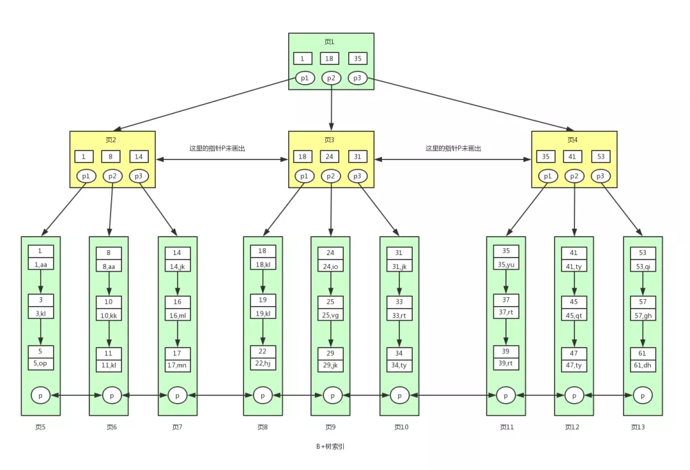
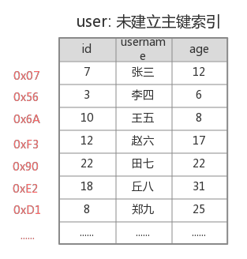
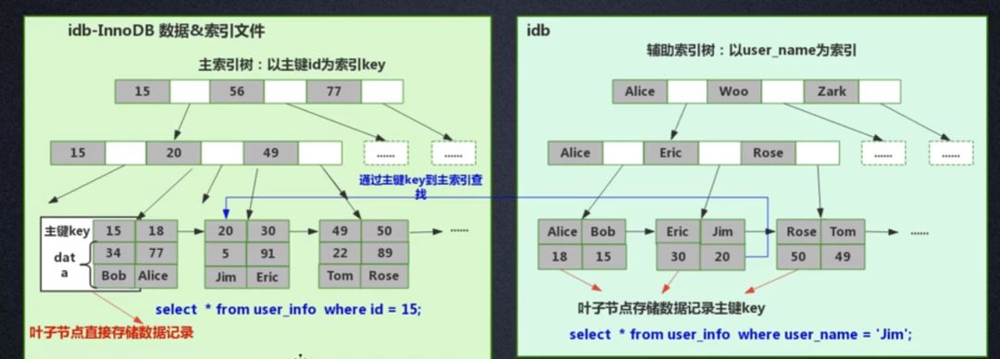

## 1. 事务

### ❌事务简介

> 事务最经典也经常被拿出来说例子就是转账了。假如小明要给小红转账1000元，这个转账会涉及到两个关键操作就是：将小明的余额减少1000元，将小红的余额增加1000元。万一在这两个操作之间突然出现错误比如银行系统崩溃，导致小明余额减少而小红的余额没有增加，这样就不对了。事务就是保证这两个关键操作要么都成功，要么都要失败。

**事务是SQL语句组成的逻辑处理单元，要么都执行，要么都不执行。**

**MySQL事务是默认提交的**。

开启事务`start transsction;`

- 开启之后，增删改需要`commit`提交才能执行成功（默认的隔离级别为**可重复读**）
- 如果发生异常需要`roll back`回滚

<br>

### 事务ACID属性


1. **原子性（Atomicity）：** 事务是最小的执行单位，不允许分割。事务的原子性确保动作要么全部完成，要么完全不起作用；
2. **一致性（Consistency）：** 执行事务前后，会使数据从一个状态切换到另一个状态，数据保持一致
3. **隔离性（Isolation）：** 并发访问数据库时，一个用户的事务不被其他事务所干扰，各并发事务之间数据库是独立的；
4. **持久性（Durability）：** 一个事务被提交之后。它对数据库中数据的改变是持久的，即使数据库发生故障也不应该对其有任何影响。

Mysql 的数据库的默认隔离级别为 Repeatable read ， 查看方式：

```sql
show variables like 'tx_isolation';
```


<br>

### 并发事务带来的问题

**同时运行的多个事务** 访问 **数据库中相同的数据时**，如果没有采取隔离级别，会导致并发问题

- **脏读（Dirty read）:** 事务（T1）正在访问数据并且对数据进行了修改，而这种修改还没有提交`commit`到数据库中，这时另外一个事务（T2）也访问了这个数据，然后使用了这个数据。<u>因为这个数据是还没有提交的数据</u>，那么另外一个事务读到的这个数据是<mark>临时的“脏数据”</mark>，依据“脏数据”所做的操作可能是不正确的。
- **丢失修改（Lost to modify）:** 指在一个事务读取一个数据时，另外一个事务也访问了该数据，那么在第一个事务中修改了这个数据后，第二个事务也修改了这个数据。这样第一个事务内的修改结果就被丢失，因此称为丢失修改。 例如：事务1读取某表中的数据A=20，事务2也读取A=20，事务1修改A=A-1，事务2也修改A=A-1，最终结果A=19，事务1的修改被丢失。
- **不可重复读（Unrepeatableread）:** 指在一个事务内多次读同一数据。在这个事务还没有结束时，另一个事务也访问该数据。那么，在第一个事务中的两次读数据之间，由于第二个事务的修改导致第一个事务两次读取的数据可能不太一样。这就发生了在一个事务内两次读到的数据是不一样的情况，因此称为不可重复读。
- **幻读（Phantom read）:** 幻读与不可重复读类似。它发生在一个事务（T1）读取了几行数据，接着另一个并发事务（T2）插入了一些数据时。在随后的查询中，第一个事务（T1）就会发现多了一些原本不存在的记录，就好像发生了幻觉一样，所以称为幻读。

**并发事务处理带来的问题**

| 问题                               | 含义                                                         |
| ---------------------------------- | ------------------------------------------------------------ |
| 丢失更新（Lost Update）            | 当两个或多个事务选择同一行，后面事务的修改值 覆盖了 前面的事务的修改值 |
| 脏读（Dirty Reads）                | 一个事务访问到了另一个事务 还未`commit`提交的数据            |
| 不可重复读（Non-Repeatable Reads） | 在同一个事务中执行了两次查询语句，两次查询出的结果不相同     |
| 幻读（Phantom Reads）              | 一个事务按照 <u>相同的查询条件</u> 重新读取以前查询过的数据，却发现其他事务插入了 满足其查询条件的新数据，再次查询多出了之前 不存在的数据 |


**脏读和不可重复读区别：**

- 脏读：只读取了一次
- 不可重复读：修改之前和修改之后读取了两次

**不可重复读和幻读区别：**

- 不可重复读：针对的是数据被修改（数据的数目不变）
- 幻读：针对的是插入删除（数据的数目发生了变化）

### 隔离级别

**数据库事务的隔离性**：数据库系统必须具有隔离 并发运行 各个事务的能力，使它们不会相互影响，避免各种并发问题。

**隔离级别：**一个事务与其他事务的 <u>隔离程度</u> 称为隔离级别 

隔离界别并不是越高越好，隔离级别越高性能越差。

<hr>


**SQL 标准定义了四个隔离级别：**

- **READ-UNCOMMITTED(读未提交)：** 最低的隔离级别，允许读取尚未提交的数据变更，**可能会导致脏读、幻读或不可重复读**。
- **READ-COMMITTED(读已提交)：** 允许读取并发事务已经提交的数据，**可以阻止脏读，但是幻读或不可重复读仍有可能发生**。
- **REPEATABLE-READ(可重复读)：** 对同一字段的多次读取结果都是一致的，除非数据是被本身事务自己所修改，**可以阻止脏读和不可重复读，但幻读仍有可能发生**。
- **SERIALIZABLE(可串行化)：** 最高的隔离级别，完全服从ACID的隔离级别。所有的事务依次逐个执行，这样事务之间就完全不可能产生干扰，也就是说，**该级别可以防止脏读、不可重复读以及幻读**。

------

>✔为可以解决，❌为无法解决


| 隔离级别         | 丢失更新 | 脏读 | 不可重复读 | 幻读 |
| ---------------- | :------: | :--: | :--------: | :--: |
| READ-UNCOMMITTED |    ✔     |  ❌   |     ❌      |  ❌   |
| READ-COMMITTED   |    ✔     |  ✔   |     ❌      |  ❌   |
| REPEATABLE-READ  |    ✔     |  ✔   |     ✔      |  ❌   |
| SERIALIZABLE     |    ✔     |  ✔   |     ✔      |  ✔   |

MySQL InnoDB 存储引擎的默认支持的隔离级别是 **REPEATABLE-READ（可重读）**。

我们可以通过`SELECT @@tx_isolation;`命令来查看

```sql
mysql> SELECT @@tx_isolation;
+-----------------+
| @@tx_isolation  |
+-----------------+
| REPEATABLE-READ |
+-----------------+
```

<br>

<hr>

<br>

## 2. B+数

### 2.1 B树与B+树的区别

B-树、B+树、红黑树都是平衡查找树，从查询效率上讲，平均都是O(log n)

**【B树与B+树的本质区别】**

- B树节点存放数据，B+树的所有数据存放在叶子节点
- B+树叶子节点是双向链表，并且是有序的

#### 叶子-非叶

**【叶子节点】**

- InnoDB：主键ID对应的行数据记录
- MyISAM：存储指向数据行的指针，可以直接取得全部的数据行数据

**【非叶子节点】**

- <font color = #1e90ff>**非叶子节点不保存数据，只保存子树的`key`的临界值（最大或者最小）**</font>。非叶子节点相当于是叶子节点的索引（稀疏索引），存储的是数据索引范围的临界值，所有的非叶子节点都可以看成是索引部分

<br>

### 2.2 B+树的优势

1. **B+树能够显著降低磁盘IO，使非叶节点的每一页能够存放更多的索引数据**。由于B+树在**非叶子结点上不包含真正的数据**，**只当做索引使用**，因此在内存相同的情况下，能够存放更多的`key`，所以每一层能够包含更多的节点因子，树高更矮。
2. **B+树的叶子结点都是相连且有序的，叶子节点间维护了双向链表，方便范围查找**。因此对整棵树的遍历只需要一次线性遍历叶子结点即可。而且由于数据顺序排列并且相连，所以便于区间查找和搜索。而B树则需要进行每一层的递归遍历
3. **更稳定的查询效率**。B+树是绝对平衡的数，时间复杂度为`O(logn)`



#### 降低磁盘IO

**从磁盘中读取数据时，都是按照磁盘页来读取的，并不是一条一条的读。** 如果我们能把尽量多的数据放进磁盘页中，那一次IO读取操作就会读取更多数据，那我们查找数据的时间也会大幅度降低。 

关系数据库这种数据量大索引能达到亿级别，为了减少内存的占用，索引也会被存储在磁盘上。B-树/B+树的特点就是**每层节点数目非常多，层数少，目的就是为了减少磁盘的IO次数**。 

但是B-树的每个节点都有`data`域（指针），这无疑是增大了节点大小，也增加了磁盘的IO次数（因为磁盘IO一次读出的数据量大小是固定的，单个数据变大，每次读出的就会减少，IO次数也会增多），而**B+树除了叶子节点其他节点并不存储数据，节点小，磁盘IO次数就少**。

#### 范围查找

B+树所有的`Data`域在叶子节点，B+树中各个页之间是通过**双向链表**连接的，叶子节点中的数据是通过**单向链表**连接的。这样遍历叶子节点就能获得全部数据，这样就能进行**区间访问**了。在数据库中基于范围的查询时非常频繁的，而B树不支持这样的遍历操作。

----------------------

### 2.3 举例计算

- `p`指针存放的是磁盘文件的地址


InnoDB每一页大小为`16kb`，存取的主键字段`int`大小为`4B`，磁盘文件地址指针`p`大小为`6B`，当前B+树高为3，且叶子节点全部放满：

- 第一层存放`16kb / (6 + 4B)` = **1638**个index
- 第二层存放**1638**个index
- 第三层为`16kb `的**data**

共计存放`1638 * 1638 * 16`= **4000万** 条主键索引数据

一般**根节点是常驻内存**的，所以一般我们查找10亿数据，只需要2次磁盘IO。

<br>

<br>

### 2.4 附录说明

B树中允许一个结点中包含多个key，可以是3个、4个、5个甚至更多，并不确定，需要看具体的实现。现在我们选择一个参数M，来构造一个B树，我们可以把它称作是M阶的B树，那么该树会具有如下特点：

- 每个结点最多有M-1个key，并且以升序排列；

- 每个结点最多能有M个子结点；

- 根结点至少有两个子结点；


####  B树的优点

由于B树的每一个节点都包含key和value，因此我们根据key查找value时，只需要找到key所在的位置，就能找到value，但B+树只有叶子结点存储数据，索引每一次查找，都必须一次一次，一直找到树的最大深度处，也就是叶子结点的深度，才能找到value。

#### B+树

B+树是对B树的一种变形树，它与B树的差异在于：

1. 非叶结点仅具有–索引作用，也就是说，**非叶子结点只存储key，不存储value**；
2. 树的所有叶结点构成一个**有序链表**，可以按照key排序的次序遍历全部数据。

#### B+树存储数据

若参数M选择为5，那么每个结点最多包含4个键值对，我们以5阶B+树为例，看看B+树的数据存储。


#### 未建立主键索引查询



执行`select * from user where id=18 `,需要从第一条数据开始，一直查询到第6条，发现id=18，此时才能查询出目标结果，共需要比较6次；

执行`select * from user where id = 18` ，如果有了索引，由于B+树的叶子结点形成了一个有序链表，所以我们只需要找到id为12的叶子结点：

- `18 > 12`，在`12`节点的右孩子
- 遍历右孩子链表，根据`key=18`，找到其地址即可

按照遍历链表的方式顺序往后查即可，共查询了3次，效率非常高。

**在区间查询时，效率体现的更加明显**


------------

【参考文章】

[1] [B-Tree和 B+Tree的数据存储结构](https://www.cnblogs.com/gekh/p/9965444.html)

[2] [MySQL为什么选择B+树作为索引结构](http://www.gxlcms.com/mysql-366759.html)

[3] [B+树叶子结点到底存储了什么](https://blog.csdn.net/Alice_8899/article/details/105357902)

[4] [数据结构之B-树、B+树](https://blog.csdn.net/xdzhouxin/article/details/80015424)


<br>

<hr>

<br>

## 3. 索引概念

### 【小结】

**InnoDB**

- 聚集索引叶子节点直接存储**主键对应的行数据记录**，B+树根据主键ID来构建
- 非聚集索引叶子节点存储**主键ID**，B+树根据该列的ASCII来构建，需要回表再走一遍聚簇索引（主键索引）

**MyISAM**

- 聚簇或非聚簇-叶节点的data域存放的是<font color = #ff4757>**数据记录的地址**</font>

<br>

### 3.1 索引分类

> 索引从不同角度划分有很多种，有时候常常是同一种名字下，包含了多种分类，所以感觉比较混杂。

按照不同的标准下，索引的分类：


#### 3.a 数据结构分

> 聚集索引并不是一种索引类型，而是一种**数据存储方式**。

索引是在MySQL的存储引擎层中实现的，而不是在服务器层实现的。MySQL目前提供了以下4种索引：

- BTREE 索引 ： 最常见的索引类型，大部分索引都支持 B 树索引
- HASH 索引：只有Memory引擎支持 ， 使用场景简单 
- R-tree 索引（空间索引）：空间索引是MyISAM引擎的一个特殊索引类型，主要用于地理空间数据类型
- Full-text （全文索引） ：全文索引也是MyISAM的一个特殊索引类型，主要用于全文索引，InnoDB从Mysql5.6版本开始支持全文索引

**MyISAM、InnoDB、Memory三种存储引擎对各种索引类型的支持**

| 索引        | InnoDB引擎      | MyISAM引擎 | Memory引擎 |
| ----------- | --------------- | ---------- | ---------- |
| BTREE索引   | 支持            | 支持       | 支持       |
| HASH 索引   | 不支持          | 不支持     | 支持       |
| R-tree 索引 | 不支持          | 支持       | 不支持     |
| Full-text   | 5.6版本之后支持 | 支持       | 不支持     |

<br>

#### 3.b 数据存储方式分（InnoDB）

B+树索引按照存储方式的不同分为<font color = #1fb6f5>**聚簇索引（聚集索引）**</font>和<font color = #1fb6f5>**非聚簇索引（非聚集索引）**</font>

##### 聚簇索引

**叶子节点包含了完整的行数据记录**

普通二级索引（非主键索引<——>非聚簇索引），存储的是索引所在行的主键


**生成聚簇索引**

1. 如果表定义了PK，则PK就是聚集索引；
2. 如果表没有定义PK，则第一个`not NULL unique`列是聚集索引；
3. 否则，InnoDB会创建一个隐藏的`row-id`作为聚集索引；

<br>

##### 非聚簇索引

**叶子节点存储的是主键ID，通过主键ID回表再走一次聚簇索引，索引覆盖（联合索引中包含了字段信息）则不必回表**



<font color = #0ada90>**针对InnoDB而言：**</font> **非聚集索引**的叶子节点不存储表中的数据，而是存储**主键值**，想要查找数据还需要根据主键再去聚集索引中进行查找，称为**回表**

> **针对InnoDB而言：** **不管以任何方式查询表， 最终都会利用主键通过聚集索引来定位到数据， 聚集索引（主键）是通往真实数据所在的唯一路径**

<font color = #0ada90>**针对MYISAM而言：**</font>因为数据和主键是分开存储的，所有索引类型都是<font color = #f51f1f>**非聚集索引**</font>，MyISAM引擎中主键索引和二级索引基本没有什么区别，索引都可以直接取得全部的数据行数据，<font color = #f51f1f>所以MyISAM表中的主键索引和二级索引都没有二次查询（回表）问题</font>


#### 【聚簇索引的优劣】

##### 优势

1. **进行IO的次数更少**。由于行数据和叶子节点存储在一起，同一页中会有多条行数据，访问同一数据页不同行记录时，已经把页加载到了Buffer中，再次访问的时候，会在内存中完成访问，不必访问磁盘。

2. 聚簇索引适合用在**排序的场合**，非聚簇索引不适合

3. 取出**一定范围数据**的时候，使用用聚簇索引
4. 可以把**相关数据保存在一起**。例如实现电子邮箱时，可以根据用户 ID 来聚集数据，这样只需要从磁盘读取少数的数据页就能获取某个用户的全部邮件。如果没有使用聚簇索引，则每封邮件都可能导致一次磁盘 I/O。

> 二级索引需要两次索引查找，而不是一次才能取到数据，因为存储引擎第一次需要通过二级索引找到索引的叶子节点，从而找到数据的**主键**，然后在聚簇索引中用主键再次查找索引，再找到数据

##### 劣势

1. 维护索引很昂贵，特别是**插入新行或者主键被更新导至要分页(page split)的时候**。
2. 表因为使用UUId（随机ID）作为主键，使数据存储稀疏，这就会出现聚簇索引有可能有比全表扫面更慢

<br>

#### 3.c 索引字段

**单值索引**


**联合索引**


#### 3.d 是否为主键

##### 主键索引和二级索引

首先定义一下什么叫主键索引，什么叫二级索引。**主键索引**一个表中只能有一个，也就是说除了主键索引以外的索引类型，都是**二级索引**。二级索引也叫**辅助键索引（结构上表现为非聚簇索引）**。注意二级索引（辅助键索引）并不是一个具体的索引类型，而是很多种索引的统称。

<br>

<br>

### 3.2 存储引擎索引

在MySQL中，索引属于存储引擎级别的概念，不同存储引擎对索引的实现方式是不同的，主要讨论MyISAM和InnoDB两个存储引擎的索引实现方式。


**InnoDB存储引擎中，主键索引就可以特指聚集索引，二级索引就可以特指非聚集索引，因为该引擎就规定了主键索引用聚集索引来管理，而聚集索引在一个表中只能有一个，所以其他的索引类型就都是非聚集索引**

**MyISAM存储引擎中，因为它不支持聚集索引，所以该引擎中的所有索引类型都是非聚集索引，即在MyISAM存储引擎中主键索引和二级索引都是非聚集索引。**

<br>

####  MyISAM引擎索引

MyISAM引擎使用B+Tree作为索引结构，叶节点的data域存放的是<font color = #ff4757>**数据记录的地址**</font>。

<font color = #ff4757>**MyISAM引擎不支持聚集索引，MyISAM表中的索引都是非聚集索引**</font>。<font color = #1abc9c>**MyISAM存储引擎是通过在叶子节点中存储指向真实行数据的指针来实现非聚集索引的**</font>。因为MyISAM引擎不支持聚集索引，所以他的所有索引类型都是非聚集索引，这其中就包括主键索引和二级索引。

因为都是非聚集索引，所以在MyISAM引擎中主键索引和二级索引基本没有什么区别，只有节点中的索引字段不同罢了，它们的**叶子节点都是存储的指向数据行存储位置的指针**。

从这里就可以看出非聚集索引中的<font color = #9b59b6>**数据行数据在物理存储器中的真实位置和索引的逻辑顺序是不同的**</font>。

下图是MyISAM索引的原理图：


这里设表一共有三列，假设我们以`Col1`为主键，则上图是一个MyISAM表的主索引（Primary key）示意。可以看出MyISAM的索引文件仅仅保存数据记录的地址。

<br>

**在MyISAM中，主索引和辅助索引（Secondary key）在结构上没有任何区别，只是主索引要求key是唯一的，而辅助索引的key可以重复。**

<br>

如果我们在Col2上建立一个辅助索引，则此索引的结构如下图所示：


MyISAM中如果指定的`Key`存在，则取出其data域的值，然后以`data`域的值为地址，读取相应数据记录

####  InnoDB引擎索引

虽然InnoDB也使用B+Tree作为索引结构，但具体实现方式却与MyISAM截然不同。

第一个重大区别是<font color = #ff4757>**InnoDB的数据文件本身就是索引文件**</font>。这个索引的key是数据表的主键，因此InnoDB表数据文件本身就是主索引。

- MyISAM索引文件和数据文件是**分离**的，索引文件仅保存**数据记录的地址**。

- 而在InnoDB中，表数据文件本身就是按B+Tree组织的一个索引结构，这棵树的叶节点data域保存了完整的数据记录


这是InnoDB主索引（同时也是数据文件）的示意图，可以看到**叶节点包含了完整的数据记录**。这种索引叫做聚集索引。因为InnoDB的数据文件本身要按主键聚集，所以<font color = #02b340>**InnoDB要求表必须有主键（MyISAM可以没有）**</font>，如果没有显式指定，则MySQL系统会自动选择一个可以唯一标识数据记录的列作为主键，如果不存在这种列，则MySQL自动为InnoDB表生成一个隐含字段作为主键，这个字段长度为6个字节，类型为长整形。

<br>

第二个与MyISAM索引的不同是InnoDB的辅助索引data域存储相应记录主键的值而不是地址。换句话说，InnoDB的所有辅助索引都引用主键作为data域。下图为定义在Col3上的一个辅助索引：


这里以英文字符的**ASCII码**作为比较准则。

聚集索引这种实现方式使得按主键的搜索十分高效，但是辅助索引搜索需要检索**两遍索引（回表）**：

1. 首先检索辅助索引获得主键
2. 然后用主键到主索引中检索获得记录


### 3.3 是否回表问题

**InnoDB的聚集索引不存在二次查询问题**。InnoDB的主键索引，因为它是通过聚集索引的方式管理的，所有表数据都存在叶子节点，所以没有二次查询问题。

**只有InnoDB存储引擎中的非聚集索引才有二次查询问题**。InnoDB中的非聚集索引（二级索引）是在叶子节点中存储的是**主键值**，所以InnoDB中在二级索引树中取得叶子节点之后如果索引字段没有覆盖查询字段，就需要进行一次**回表**，再利用得到的主键值去搜索主键索引树，这就是二次查询。

**MyISAM表中的主键索引和二级索引都没有二次查询问题。**MyISAM存储引擎只支持非聚集索引，它的非聚集索引的实现方式是是叶子节点中存储指向数据行的指针，可以直接取得全部的数据行数据，MyISAM引擎不会出现二次搜索的问题


### 3.4 Hash索引

#### 4.a HASH索引的使用

**HASH索引只有精确匹配索引所有列的查询才有效（where对等比较），Memory引擎默认使用的是此种索引。**

由于是一次定位数据，不像BTree索引需要从根节点到枝节点，最后才能访问到页节点这样多次IO访问，所以检索效率远高于BTree索引。


##### 存储

存储引擎对所有的索隐列计算出一个哈希码，将哈希码存储在索引中，同时哈希表中保存每个数据行的指针。对于此种索引查找速度是非常快的。出现哈希值碰撞的话，索引会以链表的形式存放多个记录指针到同一个哈希条目中。


如果哈希冲突很多，一些索引维护操作的代价会很高。

##### 查找

哈希索引的数据结构是：**（哈希表中哈希码是顺序的，导致对应的数据行是乱序的）**


看如下查询：

```sql
select lname from testhash where fname ='Peter'
```

Mysql首先计算`Peter`的哈希值是`8784`，然后到哈希索引中找到对应的行指针，根据指针找到对应的数据行

##### 删除

如果从表中删除一行，需要遍历链表中的每一行，找到并删除对应行的引用，冲突越多，代价越大


哈希冲突（不同索引列会用相同的哈希码）会影响查询速度，此时需遍历索引中的行指针，**逐行进行比较**。

<br>

#### 4.b HASH索引的限制

索引只存储哈希码及行指针，所以索引的数据结构非常的紧凑，这也让哈希索引查找速度非常快，但是哈希索引也有他的限制。

1. **无法直接使用索引来避免读取行。**HAHS索引中只有hash值和行数的指针，而不存储字段值。不过，访问内存中的行的速度很快（因为memory引擎的数据都保存在内存里），所以大部分情况下这一点对性能的影响并不明显。
2. **无法用于排序**，哈希索引数据并不是按照索引列的值顺序存储的
3. **不支持部分索引列匹配查找**。因为哈希索引始终是使用索引的全部列值内容来计算哈希值的。如：数据列（a,b）上建立哈希索引，如果只查询数据列a，则无法使用该索引。
4. **只支持等值比较查询，不支持任何范围查询**。必须给定具体的where条件值来计算hash值，所以不支持范围查询.如：`=`、`in()`、`<=>`、(注意，<>和<=>是不同的操作)
5. **HAHS冲突频繁，遍历链表频繁**。访问哈希索引的数据非常快，除非有很多哈希冲突，当出现哈希冲突的时候，存储引擎*必须遍历链表中所有的行指针*，逐行进行比较，直到找到所有符合条件的行。
6. **如果哈希冲突很多的话，一些索引维护操作的代价也很高**。如：如果在某个选择性很低的列上建立哈希索引（即很多重复值的列），那么当从表中删除一行时，存储引擎需要遍历对应哈希值的链表中的每一行，找到并删除对应的引用，冲突越多，代价越大。

#### 4.c 自适应HASH

InnoDB引擎有一个特殊的功能叫做**“自适应哈希索引（ adaptive hash index）**”。当InnoDB注意到某些索引值被使用得非常频繁时，它会在内存中基于B-Tree索引之上再创建一个哈希索引，这样就让B-Tree索引也具有哈希索引的一些优点，比如快速的哈希查找。这是一个完全自动的、内部的行为，用户无法控制或者配置，不过如果有必要完全可以关闭该功能

**创建自定义哈希索引：**

如果存储引擎不支持哈希索引，则可以模拟像InnoDB一样创建哈希索引，这可以享受一些哈希索引的便利。

**思路**：在B-Tree基础上创建一个伪哈希索引。这和真正的哈希索引不是一回事，因为还是使用B-Tree进行查找，但是它使用哈希值而不是键本身进行索引查找。*需要做的就是在查询的WHERE子句中手动指定使用哈希函数。*

下面是一个实例，例如需要存储大量的URL，并需要根据URL进行搜索查找：

如果使用B-Tree来存储URL，存储的内容就会很大，因为URL本身都很长。正常情况下会有如下查询：

```sql
select * from url_tb where url = "www.baidu.com";
```

若删除原来URL列上的索引，而新增一个被索引的 `url crc`列，使用**CRC32**做哈希，可以使用下面的方式查询：

```sql
select * from url_tb where url = "www.baidu.com" and url_crc = CRC32("www.baidu.com");
```

这样做的性能会非常高，因为 MySQL优化器会使用这个选择性很高而体积很小的基于`url crc`列的索引来完成查找（在上面的案例中，索引值为1560514994）。**即使有多个记录有相同的索引值，查找仍然很快**，只需要根据哈希值做快速的整数比较就能找到索引条目，然后一一比较返回对应的行。

> 另外一种方式就是对完整的URL字符串做索引那样会非常慢


--------------------

**【参考文献】**

[1] Baron Scbwartz等 著，王小东等 译；《高性能MySQL》（High Performance MySQL）；电子工业出版社，2010

[2] Michael Kofler 著，杨晓云等 译；MySQL5权威指南（The Definitive Guide to MySQL5）；人民邮电出版社，2006

[3] 姜承尧 著；MySQL技术内幕-InnoDB存储引擎；机械工业出版社，2011

[4] [MySQL索引背后的数据结构及算法原理](http://blog.codinglabs.org/articles/theory-of-mysql-index.html)

[5] [InnoDB存储引擎，MyISAM存储引擎，聚集索引，非聚集索引，主键索引，二级索引他们之间的关系梳理](https://blog.csdn.net/cy973071263/article/details/104513404/?utm_medium=distribute.wap_relevant.none-task-blog-title-4#1%E3%80%81%E4%B8%BB%E9%94%AE%E7%B4%A2%E5%BC%95%E5%92%8C%E4%BA%8C%E7%BA%A7%E7%B4%A2%E5%BC%95)

[6] [哈希索引,虽不常用，但威力巨大](https://baijiahao.baidu.com/s?id=1647079867833965110&wfr=spider&for=pc)

[7] [HASH索引的适用场景和限制](https://blog.csdn.net/sunjin9418/article/details/80334142)

[8] [哈希索引](https://blog.csdn.net/weixin_43378396/article/details/90447750)


<br>

<hr>

<br>

## 4. 索引定义

### 定义索引的类型

<font color = #f51f54>**主键通常建议使用auto_increment自增int类型**</font>。**保证聚簇索引的数据的物理存放顺序与索引顺序是一致的，当-当前页被插满后，继续插入到新的页上**

### 为什么用自增

**保证聚簇索引的数据的物理存放顺序与索引顺序是一致的**

①下一条记录就会写入新的页中，一旦数据按照这种顺序的方式加载，主键页就会近乎于顺序的记录填满，提升了页面的最大填充率，不会有页的浪费

②新插入的行一定会在原有的最大数据行下一行，mysql定位和寻址很快，不会为计算新行的位置而做出额外的消耗

③减少了页分裂和碎片的产生

--------------

即：只要索引是相邻的，那么对应的数据一定也是相邻地存放在磁盘上的。如果主键不是自增id，它会不断地调整数据的物理地址、分页，当然也有其他一些措施来减少这些操作，但却无法彻底避免。

但，如果是自增的，那就简单了，它只需要一 页一页地写，索引结构相对紧凑，磁盘碎片少，效率也高。

因为**MyISAM的主索引并非聚簇索引，那么他的数据的物理地址必然是凌乱的，拿到这些物理地址，按照合适的算法进行I/O读取，于是开始不停的寻道不停的旋转**。**聚簇索引则只需一次I/O**。（强烈的对比）

### 为什么用int

自增的`int` id，避免了 **索引的调整维护，当-当前页被插满后，继续插入到新的页上**

因为uuid相对顺序的自增id来说是毫无规律可言的，新行的值不一定要比之前的主键的值要大，所以innodb无法做到总是把新行插入到索引的最后,而是需要为新行寻找新的合适的位置从而来分配新的空间。


不过，如果涉及到大数据量的排序、全表扫描、count之类的操作的话，还是MyISAM占优势些，因为索引所占空间小，这些操作是需要在内存中完成的。

### 不推荐使用uuid或者雪花id作为主键

①写入的目标页很可能已经刷新到磁盘上并且从缓存上移除，或者还没有被加载到缓存中，innodb在插入之前不得不先找到并从磁盘读取目标页到内存中，这将导致大量的随机IO

②因为写入是乱序的,innodb不得不频繁的做页分裂操作,以便为新的行分配空间,页分裂导致移动大量的数据，一次插入最少需要修改三个页以上

③由于频繁的页分裂，页会变得稀疏并被不规则的填充，最终会导致数据会有碎片

-------------

【参考】[Yrion-深入分析mysql为什么不推荐使用uuid或者雪花id作为主键](https://www.cnblogs.com/wyq178/)

<br>

<hr>

<br>

## 5. 回表&索引覆盖&最左

数据库表结构：

```mysql
create table user (
    id int primary key,
    name varchar(20),
    sex varchar(5),
    index(name)
)engine=innodb;

select id,name where name='shenjian';

select id,name,sex where name='shenjian';
```

> 多查询了一个属性，为何检索过程完全不同？

- 什么是回表查询？
- 什么是索引覆盖？
- 如何实现索引覆盖？
- 哪些场景，可以利用索引覆盖来优化SQL？

 

### 5.1 回表查询和索引覆盖

<font color = red>InnoDB**普通索引**的叶子节点存储主键值</font>

<font color = red>**通常情况下，普通索引的查询需要扫码两遍索引树**</font>

#### 非聚簇索引

如果不是主键索引，则就可以称之为非主键索引，又可以称之为辅助索引或者二级索引。主键索引的叶子节点存储了完整的数据行，而非主键索引的叶子节点存储的则是**主键索引值**，通过非主键索引查询数据时：

- 会先查找到主键索引
- 然后再到主键索引上去查找对应的数据。

<hr>

#### 索引覆盖

在这里假设我们有张表user，具有三列：执行如下sql语句：

```mysql
ID，age，name，create_time

id是主键，(age, create_time, name) 建立辅助索引
```

`select name from user where age > 2 order by create_time desc;`

正常的话，查询分两步：

1. 按照辅助索引，查找到记录的主键
2. 按照主键主键索引里查找记录，返回name

但实际上，我们可以看到，辅助索引节点是按照`age`，`create_time`，`name`建立的，索引信息里完全包含我们所要的信息。 **因此不需要通过主键ID值的查找数据行的真实所在， 直接取得叶节点中name的值返回即可。** 通过这种覆盖索引直接查找的方式， 可以省略回表查询主键`id`， 大大的提高了查询性能

<font color = red>**将单列索引(name)升级为联合索引(name, sex)，即可避免回表**</font>。将被查询的字段，建立到联合索引里去。

按照这种思想Innodb里针对使用辅助索引的查询场景做了优化，叫**覆盖索引**

#### 回表

```mysql
select * from t where name = lisi;　
```

**是如何执行的呢？**


如**粉红色**路径，需要扫码两遍索引树：

（1）先通过普通索引定位到主键值id=5；

（2）在通过聚集索引定位到行记录；

这就是所谓的**回表查询**，先定位主键值，再定位行记录，它的性能较扫一遍索引树更低。

------------

【问题解答】：`count(*)`是统计表数据数量的，在查询的时候虽然优先走非聚集索引，但是它不需要回表操作，它只需要统计非聚集索引树上的值即可，属于mysql5.7.18新特性！

---------------

<br>

### 5.2  全列匹配

where子句几个搜索条件顺序调换不影响查询结果，因为MySQL的**查询优化器会自动调整where子句的条件顺序**以使用适合的索引。将where中的条件顺序颠倒，效果是一样的。


<br>

### 5.3 最左前缀匹配原则

**最左匹配原则的定义**：**最左优先**，以最左边的为起点任何连续的索引都能匹配上。同时遇到范围查询(`>`、`<`、`between`、`like`)就会停止匹配

<br>

**要注意使用复合索引需要满足最左侧索引的原则**，如果where条件里面没有最左边的一到多列，索引就不会起作用。

针对的是**联合索引**（使用多列组合一个索引）

```sql
create index index_name on table(a, b, c);  --联合索引a、b、c
```

**1. 建立联合索引时，要选择重复值最少的列，作为最左列**

**2. 查询条件中，必须包含最左列**

<br>

### 5.4 最左使用

**联合索引a、b、c，优先匹配a索引所在的列**

```mysql
create index index_name on table(a, b, c);
```

#### 1. 全值匹配查询

查询时必须包含`a`列，最左列索引

```sql
select * from table where a = and b =  and c = ;
```

#### 2. 匹配左边的列

**走索引**

```sql
select * from table_name where a = '1' 
select * from table_name where a = '1' and b = '2'  
select * from table_name where a = '1' and b = '2' and c = '3'
```

**不走索引**

```sql
select * from table_name where  b = '2' 
select * from table_name where  c = '3'
select * from table_name where  b = '1' and c = '3' 
```

#### 3. 匹配列前缀

前缀匹配用的是索引，后缀和中缀只能全表扫描了

```sql
select * from table_name where a like 'As%';   -- 前缀都是排好序的，走索引查询
select * from table_name where  a like '%As';  -- 全表查询
select * from table_name where  a like '%As%'; -- 全表查询
```

> 如果列是字符型的话它的比较规则是先比较字符串的第一个字符，第一个字符小的哪个字符串就比较小，如果两个字符串第一个字符相通，那就再比较第二个字符，第二个字符比较小的那个字符串就比较小，依次类推，比较字符串。

#### 4. 匹配范围值

走索引

```sql
select * from table_name where  a > 1 and a < 3
```

出现不等值情况，只会覆盖**最左列索引**

```sql
select * from table_name where  a > 1 and a < 3 and b > 1;

-- 只能覆盖到a = ,不能覆盖b和c
select * from table where a = and b <>  and c = ; 
```

#### 5. 精确匹配某一列并范围匹配另外一列

如果左边的列是精确查找的，右边的列可以进行范围查找

```sql
select * from table_name where  a = 1 and b > 3;
```

`a=1`的情况下b是有序的，进行范围查找走的是**联合索引**

#### 6. 排序

`order by`走索引，必须要保证**子句的顺序和索引列建立的顺序一致**


```sql
 select * from table_name order by a,b,c limit 10;  -- 走索引
 
 select * from table_name order by b,c,a limit 10;  -- 顺序颠倒，索引失效
 
 select * from table_name order by a limit 10;    -- 用到部分索引
select * from table_name order by a,b limit 10;   -- 用到部分索引
```

<br>


-----------------------------

【参考】[Mysql最左匹配原则](https://blog.csdn.net/sinat_41917109/article/details/88944290)


**最后总结一下**

1. 使用聚集索引的查询效率要比非聚集索引的效率要高，但是如果需要频繁去改变聚集索引的值，写入性能并不高，因为需要移动对应数据的物理位置
2. 非聚集索引在查询的时候可以的话就避免二次查询，这样性能会大幅提升。
3. 不是所有的表都适合建立索引，只有数据量大表才适合建立索引，且建立在选择性高的列上面性能会更好。

<br>

<hr>
<br>


## 6. 索引语法

MySQL高级内容简介

| 序号 | Task01             | Task02      | Task03         | Task04         |
| ---- | ------------------ | ----------- | -------------- | -------------- |
| 1    | Linux系统安装MySQL | 体系结构    | 应用优化       | MySQL 常用工具 |
| 2    | 索引               | 存储引擎    | 查询缓存优化   | MySQL 日志     |
| 3    | 视图               | 优化SQL步骤 | 内存管理及优化 | MySQL 主从复制 |
| 4    | 存储过程和函数     | 索引使用    | MySQL锁问题    | 综合案例       |
| 5    | 触发器             | SQL优化     | 常用SQL技巧    |                |

### 索引优势劣势

**优势**

1. 类似于书籍的目录索引，提高数据检索的效率，**降低数据库的IO成本**

2. **方便范围查找**。通过索引列对数据进行排序，降低数据排序的成本，降低CPU的消耗。

**劣势**

1. 实际上索引也是一张表，该表中保存了主键与索引字段，并指向实体类的记录，所以索引列也是要**占用空间**

2. **索引降低更新表的速度，维护索引也要消耗时间**。如对表进行INSERT、UPDATE、DELETE。因为更新表时，MySQL 不仅要保存数据，还要保存一下索引文件每次更新添加了索引列的字段，都会调整因为更新所带来的键值变化后的索引信息

<br>

### 索引语法

#### 添加索引

索引在创建表的时候可以同时创建， 也可以随时追加新的索引。

**创建索引**

```sql
create index 索引名 on 表名(添加到该列);

<e.g.>

create [unique] index index_name on table(表字段);
```

**ALTER追加主键索引**

```sql
-- 索引值必须是唯一的，且不能为NULL

alter  table  tb_name  add  primary  key(column_list); 
```

**唯一索引**

```sql
-- 索引的值必须是唯一的（除了NULL外，NULL可能会出现多次）

alter  table  tb_name  add  unique index_name(column_list);
```

**普通索引**

```sql
-- 添加普通索引， 索引值可以出现多次

alter  table  tb_name  add  index index_name(column_list);
```

**全文索引**

```sql
-- 索引为FULLTEXT， 用于全文索引    
alter  table  tb_name  add  fulltext  index_name(column_list);
```

<br>

#### 查看索引

```sql
show index  from  table_name;
```

<br>

#### 删除索引

```sql
DROP  INDEX  index_name  ON  table_name;
```


<br>

<hr>
<br>


## 7. 慢SQL优化

### 一. 分类讨论

一条 SQL 语句执行的很慢，那是每次执行都很慢呢？还是大多数情况下是正常的，偶尔出现很慢呢？分以下两种情况来讨论：

1. 大多数情况是正常的，只是偶尔会出现很慢的情况

2. 在数据量不变的情况下，这条SQL语句一直以来都执行的很慢

针对这两种情况，我们来分析下可能是哪些原因导致的。

### 二. 偶尔慢

SQL语句大概率是没有问题的，而而是其他原因导致的。

#### I. 数据库在刷新脏页

当我们要往数据库插入一条数据、或者要更新一条数据的时候，我们知道数据库会在**内存**中把对应字段的数据更新了，但是更新之后，这些更新的字段并不会马上同步持久化到**磁盘**中去，而是把这些更新的记录写入到 `redo log` 日记中去，等到空闲的时候，在通过 `redo log` 里的日记把最新的数据同步到**磁盘**中去。

不过，`redo log` 里的容量是有限的，如果数据库一直很忙，更新又很频繁，这个时候 redo log 很快就会被写满了，这个时候就没办法等到空闲的时候再把数据同步到磁盘的，只能暂停其他操作，全身心来把数据同步到磁盘中去的，而这个时候，**就会导致我们平时正常的SQL语句突然执行的很慢**，所以说，数据库在在同步数据到磁盘的时候，就有可能导致我们的SQL语句执行的很慢了。


#### II. 拿不到锁

判断是否真的在等待锁，我们可以用`show processlist`命令

要执行的这条语句，刚好这条语句涉及到的**表**，别人在用，并且加锁了，我们拿不到锁，只能慢慢等待别人释放锁了。

或者，表没有加锁，但要使用到的**某个一行被**加锁了，这个时候，我也没办法啊。

### 三. 一直慢

数据量一样大的情况下，这条 SQL 语句每次都执行的这么慢，**可能是SQL书写欠佳或者没走索引**

**【优化思路】：**

- 通过慢查询日志去寻找哪些 SQL 执行效率低
- 使用 `explain `获取低效率的 SQL 执行计划
- 结合 SQL 与执行计划，进行分析与优化

**引起 SQL 查询很慢的原因与解决办法：**

#### 1. 没有索引

解决办法：

- 根据 where 和 order by 使用比较频繁的字段创建索引，提高查询效率
- 索引不宜过多，单表最好不要超过 6 个。索引过多会导致占用存储空间变大；insert、update 变慢
- 删除未使用的索引

#### 2. 索引未生效

解决办法：

- 避免在 where 子句中对字段进行 null 值判断，创建表默认值是 NULL。尽量使用 NOT NULL，或使用特殊值，如 0、-1
- 避免在 where 子句中使用 != 或 <> 操作符， MySQL 只有对以下操作符才使用索引：<、<=、=、>、>=、BETWEEN、IN、非 % 开头的 LIKE
- 避免在 where 子句中使用 or 来连接条件，可以使用 UNION 进行连接
- 能用 union all 就不用 union，union 过滤重复数据要耗费更多的 CPU 资源
- 避免部分 like 查询，如 '%ConstXiong%'
- 避免在索引列上使用计算、函数
- in 和 not in 慎用，能用 between 不要用 in
- select 子句中避免使用 *

 

#### 3. 单表数据量太大

解决办法：

- 分页查询(在索引上完成排序分页操作、借助主键进行关联)
- 单表数据过大，进行分库分表
- 考虑使用非关系型数据库提高查询效率
- 全文搜索场景较多，考虑使用 ElasticSearch、solr

 

### 四. explain使用

`explain` 这个命令来查看这些 SQL 语句的执行计划，**查看该 SQL 语句有没有使用上了索引，有没有做全表扫描**。

#### 性能分析explain

使用`EXPLAIN`关键字可以模拟优化器执行SQL查询语句，从而知道MySQL是如何处理你的SQL语句的。分析你的查询语句或是表结构的性能瓶颈，针对出现的问题调整索引。

这都可以通过 explain 命令来查看，总结一下就是：

1. 表的读取顺序
2. 表的读取操作的操作类型
3. 哪些索引可以使用
4. <font color = red>哪些索引被实际使用</font>
5. 表之间的引用
6. <font color = red>每张表有多少行被优化器查询</font>

比如以下简单的语句：`select * from search_search `，如果在前方加入 explain ，表结构如下：


<font color = #ff6b81>**type **</font>的值为 ALL，即表示全表扫描，由于我们的 `select` 语句没有任何的优化，每一次查询都会遍历整个表。

---------------

通常来说，我们的查询不应该出现 ALL 类型的查询，因为这样的查询在数据量大的情况下，对数据库的性能是巨大的灾难，如一个查询是 ALL 类型查询，那么一般来说可以对相应的字段添加索引来避免。

不过这里需要注意，虽然 Explain 可以有这些特性，但是在使用上还是需要注意一些点，比如：

- 它不会考虑各种 cache
- 只能解释 select 操作
- 不能显示 MySQL 在执行查询时所作的优化工作

### 五. SQL查询优化

对于查询语句来说，我们优化的方向可以从以下几个思路着手

1. **首先打开慢查询记录，并找到慢查询记录所在的位置：**

```sql
set global log_queries_not_using_indexes = on;  -- 开启记录

show variables like 'slow_query_log_file%';
```

2. **使用 explain 分析语句时若发现 rows 非常大的查询语句可以考虑在对应的关键词上加入索引**

3. **子查询尽量修改为 JOIN 查询**
4. **尽量避免在 where 子句中使用 or 来连接条件，否则将导致引擎放弃使用索引而进行全表扫描，即使其中有条件带索引也不会使用**
5. **如果列类型是字符串，那一定要在条件中将数据使用引号引用起来，否则不会使用索引**
6. **应尽量避免在 where 子句中使用 != 或 <> 操作符，否则引擎将放弃使用索引而进行全表扫描**
7. **在搜索字符型字段时，我们有时会使用LIKE关键字和通配符，这种做法虽然简单，但却也是以牺牲系统性能为代价的，通过换为 >= 可以有效提升速度**

```sql
SELECT * FROM books WHERE name like "MySQL%";

SELECT  * FROM books WHERE name ＞=  "MySQL" and name ＜"MySQM"
```


### 六. 提升性能的一些技巧

- 尽量使用数字型字段
- 只需要一行数据时使用 limit 1
- 索引尽量选择较小的列
- 不需要的数据在 GROUP BY 之前过滤掉
- 大部分时候 exists、not exists 比 in、not in 效率（除了子查询是小表的情况使用 in 效率比 exists 高）
- 不确定长度的字符串字段使用 varchar/nvarchar，如使用 char/nchar 定长存储会带来空间浪费
- 不要使用 select *，去除不需要的字段查询
- 避免一次性查询过大的数据量
- 使用表别名，减少多表关联解析时间
- 多表 join 最好不超过 5 个，视图嵌套最好不超过 2 个
- or 条件查询可以拆分成 UNION 多个查询
- count(1) 比 count(*) 有效
- 判断是否存在数据使用 exists 而非 count，count 用来获取数据行数

